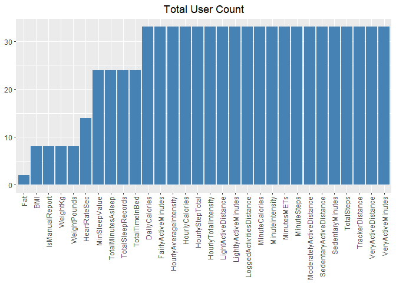
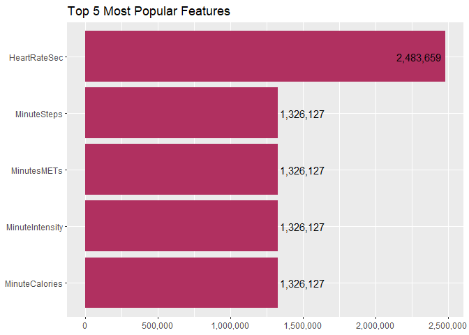
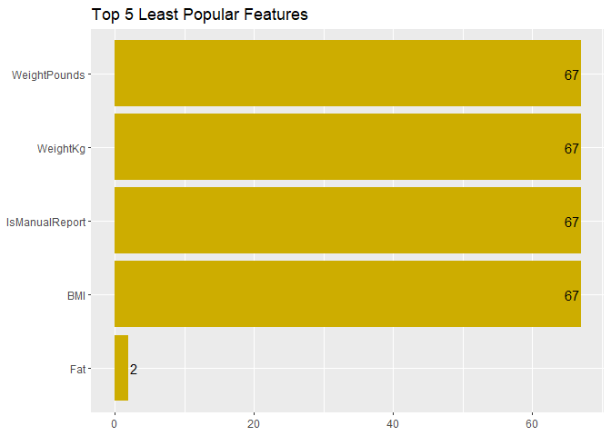
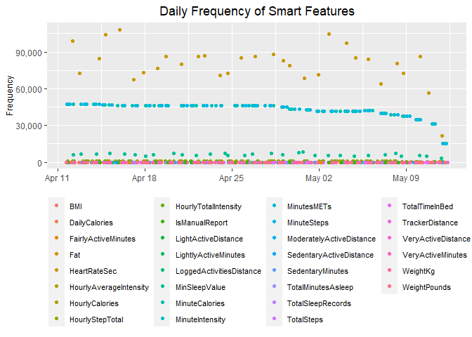
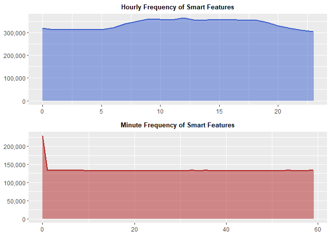
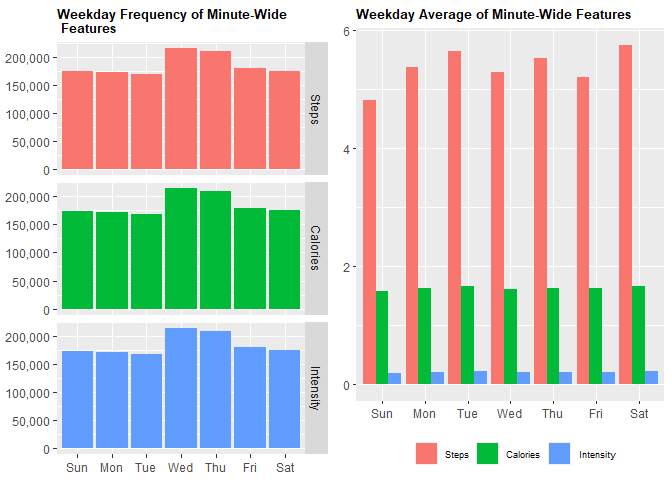
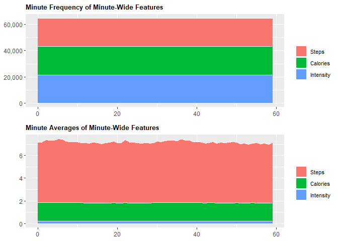

Bellabeat Case Study
================
Leopoldine Mirtil

### Disclaimer

This analysis was made from the *Bellabeat Case Study: How Can a
Wellness Technology Company Play It Smart?*, offered through the Google
Data Analytics Certificate program on Coursera.com. The data is from the
[FitBit Fitness Tracker
Data](https://www.kaggle.com/datasets/arashnic/fitbit?resource=download)
from Kaggle.com and was originally uploaded by the user Möbius for
public use. The data covers one month of collection from 4/12/2016 to
5/12/2016 from over 30 consenting users.

## Introduction

#### Scenario

You are a junior data analyst working on the marketing analyst team at
Bellabeat, a high-tech manufacturer of health-focused products for
women. Bellabeat is a successful small company, but they have the
potential to become a larger player in the global smart device market.
Urška Sršen, cofounder and Chief Creative Officer of Bellabeat, believes
that analyzing smart device fitness data could help unlock new growth
opportunities for the company. You have been asked to focus on one of
Bellabeat’s products and analyze smart device data to gain insight into
how consumers are using their smart devices. The insights you discover
will then help guide marketing strategy for the company. You will
present your analysis to the Bellabeat executive team along with your
high-level recommendations for Bellabeat’s marketing strategy.

#### Tasks

1.  What are some trends in smart device usage?
2.  How could these trends apply to Bellabeat customers?
3.  How could these trends help influence Bellabeat marketing strategy?

## Get to Work

### Step 1 - Import Data

#### Load Packages

``` r
library(tidyr)
library(tidyverse)
library(dplyr)
library(knitr)
library(lubridate)
library(chron)
library(pastecs)
library(ggplot2)
```

I chose these specific packages to enable: data manipulation,
documentation, descriptive statistics and visualization.

#### Set Directory & Import Data

``` r
setwd('C:/Users/Leopoldine/Desktop/Mine/Coding Projects & Portfolio/Bellabeat Case Study/00_raw_data')

dailyActs <- read.csv('dailyActivity_merged.csv')
dailyCals <- read.csv('dailyCalories_merged.csv')
dailyInts <- read.csv('dailyIntensities_merged.csv')
dailySteps <- read.csv('dailySteps_merged.csv')
hrate_sec <- read.csv('heartrate_seconds_merged.csv')
hrCals <- read.csv('hourlyCalories_merged.csv')
hrInts <- read.csv('hourlyIntensities_merged.csv')
hrSteps <- read.csv('hourlySteps_merged.csv')
minCalsN <- read.csv('minuteCaloriesNarrow_merged.csv')  
minCalsW <- read.csv('minuteCaloriesWide_merged.csv')
minIntsN <- read.csv('minuteIntensitiesNarrow_merged.csv')
minIntsW <- read.csv('minuteIntensitiesWide_merged.csv')
minMETsN <- read.csv('minuteMETsNarrow_merged.csv')
minSleep <- read.csv('minuteSleep_merged.csv')
minStepsN <- read.csv('minuteStepsNarrow_merged.csv')
minStepsW <- read.csv('minuteStepsWide_merged.csv')
sleepDay <- read.csv('sleepDay_merged.csv')
weightLog <- read.csv('weightLogInfo_merged.csv')
```

I set the directory first to make it easier to import all the data files
without having to include the full file path every time.

### Step 2 - Clean Data

#### Review Daily Data Sets

I noticed that the ‘dailyActs’ file had similar columns to the other
daily data sets. I decided to first confirm if they were identical, and
if so, remove those files.

##### Compare Daily Dataframes

``` r
##dailyActs vs dailyCals
# TRUE = equal, False=not equal
all.equal(dailyActs$Calories, dailyCals$Calories) 
```

    ## [1] TRUE

``` r
all.equal(dailyActs$Id, dailyCals$Id)
```

    ## [1] TRUE

``` r
all.equal(dailyActs$ActivityDate, dailyCals$ActivityDay)
```

    ## [1] TRUE

``` r
##dailyActs vs dailySteps
all.equal(dailyActs$TotalSteps, dailySteps$StepTotal) 
```

    ## [1] TRUE

``` r
all.equal(dailyActs$Id, dailySteps$Id)
```

    ## [1] TRUE

``` r
all.equal(dailyActs$ActivityDate, dailySteps$ActivityDay)
```

    ## [1] TRUE

``` r
#dailyActs vs dailyInts
all.equal(dailyActs$Id, dailyInts$Id)
```

    ## [1] TRUE

``` r
all.equal(dailyActs$ActivityDate, dailyInts$ActivityDay)
```

    ## [1] TRUE

``` r
#dailyActs vs dailyInts
##convert columns into data tables for comparison
d_Acts <- data.table::setDT(dailyActs[7:14])
d_Ints <- data.table::setDT(dailyInts[3:10])

all.equal(d_Acts, d_Ints, ignore.col.order = TRUE)
```

    ## [1] TRUE

I had to convert the remaining columns in ‘dailyActs’ & ‘dailyInts’ into
data tables, due to different column orders, in order to perform a
comparison.

``` r
#compare similar columns 'TotalDistance' vs 'TrackerDistance'
tod <- data.table::setDT(dailyActs[5])
trd <- data.table::setDT(dailyActs[6])

all.equal(tod, trd)
```

    ## [1] "Different column names"

``` r
#remove a column
dailyActs <- select(dailyActs, -c(TotalDistance))
```

I removed the ‘TotalDistance’ column after confirming it was identical
to the ‘TrackerDistance’ column, other than the column name. There was
no point in having a duplicate column.

##### Change Data Type of Column

``` r
dailyActs$ActivityDate <- as.Date(dailyActs$ActivityDate, '%m/%d/%Y') 
```

After removing the unnecessary ‘daily’ files, I changed the data type
and format of the ‘ActivityDate’ column as I will use it as a key point
when merging the data sets later on.

#### Review Hourly Data sets

##### Compare Hourly Dataframes

``` r
#check Id columns
all.equal(hrCals$Id, hrInts$Id)
```

    ## [1] TRUE

``` r
all.equal(hrSteps$Id, hrInts$Id)
```

    ## [1] TRUE

``` r
#check Activity columns
all.equal(hrCals$ActivityHour, hrInts$ActivityHour)
```

    ## [1] TRUE

``` r
all.equal(hrSteps$ActivityHour, hrInts$ActivityHour)
```

    ## [1] TRUE

I confirmed that the ‘Id’ and ‘ActivityHour’ columns were identical in
order to use both as keys when merging the data files.

##### Merge Hourly Data Sets

``` r
hourlyActs <- bind_cols(hrCals, hrSteps[3], hrInts[3:4])

# view data
str(hourlyActs)
```

    ## 'data.frame':    22099 obs. of  6 variables:
    ##  $ Id              : num  1503960366 1503960366 1503960366 1503960366 1503960366 ...
    ##  $ ActivityHour    : chr  "4/12/2016 12:00:00 AM" "4/12/2016 1:00:00 AM" "4/12/2016 2:00:00 AM" "4/12/2016 3:00:00 AM" ...
    ##  $ Calories        : int  81 61 59 47 48 48 48 47 68 141 ...
    ##  $ StepTotal       : int  373 160 151 0 0 0 0 0 250 1864 ...
    ##  $ TotalIntensity  : int  20 8 7 0 0 0 0 0 13 30 ...
    ##  $ AverageIntensity: num  0.333 0.133 0.117 0 0 ...

#### Review Minute Data Sets

##### Compare Minute Data Frames

``` r
# check Id&ActivityMinute columns 
all.equal(minCalsN[1:2],minStepsN[1:2])
```

    ## [1] TRUE

``` r
all.equal(minIntsN[1:2],minMETsN[1:2])
```

    ## [1] TRUE

``` r
all.equal(minCalsN[1:2],minMETsN[1:2])
```

    ## [1] TRUE

``` r
all.equal(minCalsW[1:2],minStepsW[1:2])
```

    ## [1] TRUE

``` r
all.equal(minIntsW[1:2],minCalsW[1:2])
```

    ## [1] TRUE

Same as above, I confirmed that the ‘Id’ and ‘ActivityMinute’ columns
were identical before merging the files.

##### Merge Minute-Narrow Dataframes

``` r
minActsN <- bind_cols(minCalsN, minStepsN[3], minIntsN[3], minMETsN[3])
str(minActsN)
```

    ## 'data.frame':    1325580 obs. of  6 variables:
    ##  $ Id            : num  1503960366 1503960366 1503960366 1503960366 1503960366 ...
    ##  $ ActivityMinute: chr  "4/12/2016 12:00:00 AM" "4/12/2016 12:01:00 AM" "4/12/2016 12:02:00 AM" "4/12/2016 12:03:00 AM" ...
    ##  $ Calories      : num  0.786 0.786 0.786 0.786 0.786 ...
    ##  $ Steps         : int  0 0 0 0 0 0 0 0 0 0 ...
    ##  $ Intensity     : int  0 0 0 0 0 0 0 0 0 0 ...
    ##  $ METs          : int  10 10 10 10 10 12 12 12 12 12 ...

##### Merge Minute-Wide Dataframes

``` r
minWide <- bind_cols(minCalsW, minIntsW[,3:62], minStepsW[,3:62]) 
```

### Step 3 - Modify Data

#### Rename Columns

``` r
dailyActs <- rename(dailyActs, DailyActsDate=ActivityDate, DailyCalories=Calories, DailyId=Id)
sleepDay <- rename(sleepDay, SleepDateTime=SleepDay, SleepDayId=Id)
hourlyActs <- rename(hourlyActs, HourlyId=Id, HourlyCalories=Calories, HourlyStepTotal=StepTotal, HourlyTotalIntensity=TotalIntensity, HourlyAverageIntensity=AverageIntensity)
hrate_sec <- rename(hrate_sec, HRateId=Id, HRateDateTime=Time, HeartRateSec=Value)
minActsN <- rename(minActsN, MinActsId=Id, DateMinute=ActivityMinute, MinuteCalories=Calories, MinuteSteps=Steps, MinuteIntensity=Intensity, MinutesMETs=METs)
minSleep <- rename(minSleep, MinSleepId=Id, MinSleepDateTime=date, MinSleepValue=value, MinSleepLogId=logId)
weightLog <- rename(weightLog, WeightId=Id, WeightDateTime=Date, WeightLogId=LogId)
minWide <- rename(minWide, DateTime=ActivityHour)
```

I changed the names of these columns to be more descriptive and for
easier identification when combining all the files.

#### Add New Columns

##### Add Date-Only Columns

``` r
hourlyActs$HourlyDate <- as.Date(hourlyActs$ActivityHour, '%m/%d/%Y')
minActsN$MinuteDates <- as.Date(minActsN$DateMinute, '%m/%d/%Y')
minSleep$MinSleepDate <- as.Date(minSleep$MinSleepDateTime, '%m/%d/%Y')
sleepDay$SleepDate <- as.Date(sleepDay$SleepDateTime, '%m/%d/%Y')
weightLog$WeightDate <- as.Date(weightLog$WeightDateTime, '%m/%d/%Y')
hrate_sec$HRateDate <- as.Date(hrate_sec$HRateDateTime, '%m/%d/%Y')
minWide$Date <- as.Date(minWide$DateTime, '%m/%d/%Y %r')
```

##### Add Time-Only Columns

``` r
hourlyActs$Hour <- chron(times.=(format(strptime(hourlyActs$ActivityHour, '%m/%d/%Y %r'), '%H:%M:%S')))
minActsN$Minutes <- chron(times.=(format(strptime(minActsN$DateMinute, '%m/%d/%Y %r'), '%H:%M:%S')))
minSleep$SleepMinutes <- chron(times.=(format(strptime(minSleep$MinSleepDateTime, '%m/%d/%Y %r'), '%H:%M:%S')))
sleepDay$SleepTime <- chron(times.=(format(strptime(sleepDay$SleepDateTime, '%m/%d/%Y %r'), '%H:%M:%S')))
weightLog$WeightTime <- chron(times.=(format(strptime(weightLog$WeightDateTime, '%m/%d/%Y %r'), '%H:%M:%S')))
hrate_sec$HRateTime <- chron(times.=(format(strptime(hrate_sec$HRateDateTime, '%m/%d/%Y %r'), '%H:%M:%S')))
minWide$Time <- chron(times.=(format(strptime(minWide$DateTime, '%m/%d/%Y %r'), '%H:%M:%S')))
dailyActs$DailyTime <- chron(times.=(as.numeric(NA))) 
```

I added date and time columns to the data sets to use as primary keys
when merging all the files together.

#### Reorganize Columns

``` r
# move new Date & Time cols 
hourlyActs <- hourlyActs[, c(1, 2, 7, 8, 3:6)]
minActsN <- minActsN[, c(1, 2, 7, 8, 3:6)]
minSleep <- minSleep[, c(1, 2, 5, 6, 3, 4)]
sleepDay <- sleepDay[, c(1, 2, 6, 7, 3:5)]
weightLog <- weightLog[, c(1, 2, 9, 10, 3:8)]
hrate_sec <- hrate_sec[, c(1, 2, 4, 5, 3)]
minWide <- minWide[, c(1, 2, 183, 184, 3:182)]

#move 'DailyCalories' and Time
dailyActs <- dailyActs[, c(1, 2, 15, 14, 3:13)] 
```

I moved the new date and time columns for readability and to make it
easier to merge the data sets all together. I also took the time to move
the ‘DailyCalories’ column from the end of the ‘dailyActs’ data set.

#### Confirm Date Ranges

The data was collected over a one month period from 4/12/2016 to
5/12/2016. I decided to verify that all dates of all the data sets were
in range.

``` r
range(dailyActs$DailyActsDate)
```

    ## [1] "2016-04-12" "2016-05-12"

``` r
range(hourlyActs$HourlyDate) 
```

    ## [1] "2016-04-12" "2016-05-12"

``` r
range(minActsN$MinuteDates)
```

    ## [1] "2016-04-12" "2016-05-12"

``` r
range(minSleep$MinSleepDate) 
```

    ## [1] "2016-04-11" "2016-05-12"

``` r
range(sleepDay$SleepDate) 
```

    ## [1] "2016-04-12" "2016-05-12"

``` r
range(weightLog$WeightDate) 
```

    ## [1] "2016-04-12" "2016-05-12"

``` r
range(hrate_sec$HRateDate)  
```

    ## [1] "2016-04-12" "2016-05-12"

``` r
range(minWide$Date) 
```

    ## [1] "2016-04-13" "2016-05-13"

The only data sets containing out of range dates are ‘minSleep’
(4/11/2016 - 5/12/2016) and ‘minWide’ (4/13/2016- 5/13/2016).

#### Remove Out of Range Dates

``` r
# remove 4/11 data rows from minSleep
minSleep <- minSleep[minSleep[['MinSleepDate']]>='2016-04-12', ] 
#remove 5/13 data rows from minWide
minWide <- minWide[minWide[['Date']]<='2016-05-12', ]
# confirm date range
range(minSleep$MinSleepDate)
```

    ## [1] "2016-04-12" "2016-05-12"

``` r
range(minWide$Date)
```

    ## [1] "2016-04-13" "2016-05-12"

I decided to remove the out of range dates from both data sets in order
to keep the dates within range.

#### Convert Logical Values to Integers

``` r
weightLog$IsManualReport <- as.integer(as.logical(weightLog$IsManualReport))
```

I converted the logical values of the ‘IsManualReport’ column into
integers where TRUE=1 and FALSE=0. I did this to enable easier analysis
of this feature.

#### Remove Column

``` r
minWide <- select(minWide, -c(DateTime))
```

I removed this column because it was unneeded after adding the date and
time columns.

#### Export Modified Dataframes

``` r
setwd('C:/Users/Leopoldine/Desktop/Mine/Coding Projects & Portfolio/Bellabeat Case Study/01_tidy_data')

write.csv(dailyActs, "dailyActs.csv", row.names = FALSE)
write.csv(hourlyActs, "hourlyActs.csv", row.names = FALSE)
write.csv(hrate_sec, "hrate_sec.csv", row.names = FALSE)
write.csv(minActsN, "minActsN.csv", row.names = FALSE)
write.csv(minSleep, "minSleep.csv", row.names = FALSE)
write.csv(minWide, "minWide.csv", row.names = FALSE)
write.csv(sleepDay, "sleepDay.csv", row.names = FALSE)
write.csv(weightLog, "weightLog.csv", row.names = FALSE)
```

I exported these modified files as a precaution before merging the
remaining data sets together. If anything goes wrong, I would be able to
start over from this point.

#### Merge Data Sets

``` r
#join dailyActs & sleepDay datsets by Id & date 
use1 <- full_join(dailyActs, sleepDay, by=join_by(DailyId==SleepDayId, DailyActsDate==SleepDate), keep=TRUE) # keep=TRUE keeps matching column
#remove unnecessary columns 
use1 <- select(use1, -c(SleepDateTime))
```

``` r
# join daily data and hourly dataset
## merge smaller dataset to larger data set to keep order in Id, Date and Time
use2 <- full_join(use1, hourlyActs, by=join_by(DailyId==HourlyId, DailyActsDate==HourlyDate, SleepTime==Hour), keep=TRUE) 
use2 <- select(use2, -c(ActivityHour))

# clear previous joined files
rm(use1, hourlyActs, dailyActs, sleepDay)
```

``` r
# join minute datasets together
use3 <- full_join(minActsN, minSleep, by=join_by(MinActsId==MinSleepId, MinuteDates==MinSleepDate, Minutes==SleepMinutes), keep=TRUE)
use3 <- select(use3, -c(DateMinute, MinSleepDateTime))
rm(minActsN, minSleep)
gc()

# combine use2 &  use3
use4 <- full_join(use2, use3, by=join_by(DailyId==MinActsId, DailyActsDate==MinuteDates, Hour==Minutes), keep=TRUE)
rm(use2, use3)
gc()

### will add remaining data sets separately to primary data
# join use4 + hrate
use5 <- full_join(use4, hrate_sec, by=join_by(DailyId==HRateId, DailyActsDate==HRateDate, Minutes==HRateTime), keep=TRUE) 
use5 <- select(use5, -c(HRateDateTime))

# join use4.5 + weight Log
smart_dev_use <- full_join(use5, weightLog, by=join_by(DailyId==WeightId, DailyActsDate==WeightDate, HRateTime==WeightTime), keep=TRUE) 
smart_dev_use <- select(smart_dev_use, -c(WeightDateTime))
rm(use4, use5, hrate_sec, weightLog) #clear environment
gc()
```

I merged all the remaining data sets together except the ‘minWide’ data
set due to its different format. Since I was creating a large data file,
I cleared up unnecessary columns and memory in between merging files to
avoid a system crash.

#### Export Merged Data Frame

``` r
# set directory
setwd('C:/Users/Leopoldine/Desktop/Mine/Coding Projects & Portfolio/Bellabeat Case Study/01_tidy_data')

#export file 
write.csv(smart_dev_use, 'smart_dev_use.csv', row.names = FALSE)
```

I made sure to export the merged file as a precaution before making
further modifications to the data.

### Step 4- Further Modify Combined Dataset

#### Create Primary Id column

``` r
#new copy in case of error
smartDev <- smart_dev_use  

# Primary Id column == DailyId
# use all except SleepDayId (in range)
smartDev$DailyId <- ifelse(is.na(smartDev$DailyId), smartDev$MinActsId, smartDev$DailyId)
smartDev$DailyId <- ifelse(is.na(smartDev$DailyId), smartDev$HourlyId, smartDev$DailyId)
smartDev$DailyId <- ifelse(is.na(smartDev$DailyId), smartDev$HRateId, smartDev$DailyId)
smartDev$DailyId <- ifelse(is.na(smartDev$DailyId), smartDev$MinSleepId, smartDev$DailyId)
smartDev$DailyId <- ifelse(is.na(smartDev$DailyId), smartDev$WeightId, smartDev$DailyId)

# remove other Id columns
smartDev <- select(smartDev, -c(SleepDayId, HourlyId, MinActsId, HRateId, WeightId, MinSleepId, MinSleepLogId, WeightLogId))

## confirm no more NA values 
sum(is.na(smartDev$DailyId))
```

    ## [1] 0

I turned the ‘DailyId’ column into the primary ‘Id’ column. I used the
ifelse function to fill the blank spaces with the other Id columns,
except for the ‘SleepDayId’ which was already in range. I confirmed
there were no missing values after modifying the column.

#### Create Primary Date Column

``` r
# Primary Column: DailyActsDate
# use all dates except SleepDate(in range)
smartDev <- smartDev %>% mutate(DailyActsDate=coalesce(DailyActsDate, MinuteDates))
smartDev <- smartDev %>% mutate(DailyActsDate=coalesce(DailyActsDate, HourlyDate))
smartDev <- smartDev %>% mutate(DailyActsDate=coalesce(DailyActsDate, HRateDate))
smartDev <- smartDev %>% mutate(DailyActsDate=coalesce(DailyActsDate, MinSleepDate))
smartDev <- smartDev %>% mutate(DailyActsDate=coalesce(DailyActsDate, WeightDate))

# remove date columns
smartDev <- select(smartDev, -c(SleepDate, HourlyDate, MinuteDates, MinSleepDate, HRateDate, WeightDate))

## confirm no more NA values 
sum(is.na(smartDev$DailyActsDate))
```

    ## [1] 0

I turned the ‘DailyActsDate’ column into the primary date column,
filling the column with the values from the other date columns. I
removed the other date columns and confirmed that the primary had no
missing values.

#### Create Primary Time Column

``` r
smartDev <- rename(smartDev, Time=DailyTime)

# merge time columns
smartDev <- smartDev %>% mutate(Time=coalesce(Time, SleepTime))
smartDev <- smartDev %>% mutate(Time=coalesce(Time, Minutes))
smartDev <- smartDev %>% mutate(Time=coalesce(Time, Hour))
smartDev <- smartDev %>% mutate(Time=coalesce(Time, HRateTime))
smartDev <- smartDev %>% mutate(Time=coalesce(Time, SleepMinutes))
smartDev <- smartDev %>% mutate(Time=coalesce(Time, WeightTime))

# remove columns
smartDev <- select(smartDev, -c(SleepTime, Hour, Minutes, SleepMinutes, HRateTime, WeightTime))
```

I used the other time columns to fill in the blanks of the primary
‘Time’ column. I moved the time column from the end to after the date
column for easier readability.

#### Clean up Modified Data Frame

``` r
#Rename columns
smartDev <- rename(smartDev, Id=DailyId, Date=DailyActsDate)

# clear environment
rm(smart_dev_use)
gc()
```

I renamed the primary columns to those that are more self-descriptive
and appropriate.

#### View Merged Dataframe

``` r
str(smartDev)
```

    ## 'data.frame':    3893669 obs. of  33 variables:
    ##  $ Id                      : num  1503960366 1503960366 1503960366 1503960366 1503960366 ...
    ##  $ Date                    : Date, format: "2016-04-12" "2016-04-13" ...
    ##  $ Time                    : 'times' num  00:00:00 00:00:00 NA 00:00:00 00:00:00 00:00:00 NA 00:00:00 00:00:00 00:00:00 ...
    ##   ..- attr(*, "format")= chr "h:m:s"
    ##  $ DailyCalories           : int  1985 1797 1776 1745 1863 1728 1921 2035 1786 1775 ...
    ##  $ TotalSteps              : int  13162 10735 10460 9762 12669 9705 13019 15506 10544 9819 ...
    ##  $ TrackerDistance         : num  8.5 6.97 6.74 6.28 8.16 ...
    ##  $ LoggedActivitiesDistance: num  0 0 0 0 0 0 0 0 0 0 ...
    ##  $ VeryActiveDistance      : num  1.88 1.57 2.44 2.14 2.71 ...
    ##  $ ModeratelyActiveDistance: num  0.55 0.69 0.4 1.26 0.41 ...
    ##  $ LightActiveDistance     : num  6.06 4.71 3.91 2.83 5.04 ...
    ##  $ SedentaryActiveDistance : num  0 0 0 0 0 0 0 0 0 0 ...
    ##  $ VeryActiveMinutes       : int  25 21 30 29 36 38 42 50 28 19 ...
    ##  $ FairlyActiveMinutes     : int  13 19 11 34 10 20 16 31 12 8 ...
    ##  $ LightlyActiveMinutes    : int  328 217 181 209 221 164 233 264 205 211 ...
    ##  $ SedentaryMinutes        : int  728 776 1218 726 773 539 1149 775 818 838 ...
    ##  $ TotalSleepRecords       : int  1 2 NA 1 2 1 NA 1 1 1 ...
    ##  $ TotalMinutesAsleep      : int  327 384 NA 412 340 700 NA 304 360 325 ...
    ##  $ TotalTimeInBed          : int  346 407 NA 442 367 712 NA 320 377 364 ...
    ##  $ HourlyCalories          : int  81 69 NA 60 77 47 NA 47 54 54 ...
    ##  $ HourlyStepTotal         : int  373 144 NA 83 459 0 NA 0 16 17 ...
    ##  $ HourlyTotalIntensity    : int  20 14 NA 6 15 0 NA 0 2 2 ...
    ##  $ HourlyAverageIntensity  : num  0.333 0.233 NA 0.1 0.25 ...
    ##  $ MinuteCalories          : num  0.786 1.888 NA 0.944 4.09 ...
    ##  $ MinuteSteps             : int  0 4 NA 0 77 0 NA 0 0 0 ...
    ##  $ MinuteIntensity         : int  0 1 NA 0 2 0 NA 0 0 0 ...
    ##  $ MinutesMETs             : int  10 24 NA 12 52 10 NA 10 12 12 ...
    ##  $ MinSleepValue           : int  NA NA NA NA NA 1 NA NA NA NA ...
    ##  $ HeartRateSec            : int  NA NA NA NA NA NA NA NA NA NA ...
    ##  $ WeightKg                : num  NA NA NA NA NA NA NA NA NA NA ...
    ##  $ WeightPounds            : num  NA NA NA NA NA NA NA NA NA NA ...
    ##  $ Fat                     : int  NA NA NA NA NA NA NA NA NA NA ...
    ##  $ BMI                     : num  NA NA NA NA NA NA NA NA NA NA ...
    ##  $ IsManualReport          : int  NA NA NA NA NA NA NA NA NA NA ...

#### Export Final Merged Dataframe

``` r
setwd('C:/Users/Leopoldine/Desktop/Mine/Coding Projects & Portfolio/Bellabeat Case Study/01_tidy_data')

#export final merged file
write.csv(smartDev, 'smartDev.csv', row.names = FALSE)
```

I exported the final merged file as a precaution before manipulating the
files further.

### Step 5 - Transpose Dataframes

#### Pivot Smart Features Dataframe

``` r
# create new dataframe in case of error
smart_d2 <- smartDev

#transpose data 
mod_smart <- 
smart_d2 %>%
  pivot_longer(cols=c(DailyCalories:IsManualReport), 
               names_to = 'SmartFeatures', 
               values_to = 'Values', 
               values_drop_na = TRUE)

#view pivoted data
head(mod_smart) 
```

    ## # A tibble: 6 × 5
    ##           Id Date       Time     SmartFeatures               Values
    ##        <dbl> <date>     <times>  <chr>                        <dbl>
    ## 1 1503960366 2016-04-12 00:00:00 DailyCalories             1985    
    ## 2 1503960366 2016-04-12 00:00:00 TotalSteps               13162    
    ## 3 1503960366 2016-04-12 00:00:00 TrackerDistance              8.5  
    ## 4 1503960366 2016-04-12 00:00:00 LoggedActivitiesDistance     0    
    ## 5 1503960366 2016-04-12 00:00:00 VeryActiveDistance           1.88 
    ## 6 1503960366 2016-04-12 00:00:00 ModeratelyActiveDistance     0.550

I decided to transpose (or pivot) the data to have all the smart
features in one column and their values in another. As seen above, it
cut down the amount of columns and will make it easier to efficiently
analyze the data.

#### Pivot Minute-Wide Features Dataframe

##### Create Features Column

``` r
## split Cals00-59, Steps00-59, Ints00-59 
mod_minWide <-
minWide %>%
pivot_longer(
    cols=!c(Id, Date, Time),
    names_to = c('Features', '.value'), 
    names_pattern = '(.*)(.\\d)')

#view pivoted data
head(mod_minWide)
```

    ## # A tibble: 6 × 64
    ##          Id Date       Time  Features  `00`   `01`  `02`  `03`  `04`  `05`  `06`
    ##       <dbl> <date>     <tim> <chr>    <dbl>  <dbl> <dbl> <dbl> <dbl> <dbl> <dbl>
    ## 1    1.50e9 2016-04-13 00:0… Calories 1.89   2.20  0.944 0.944 0.944 2.04  0.944
    ## 2    1.50e9 2016-04-13 00:0… Intensi… 1      1     0     0     0     1     0    
    ## 3    1.50e9 2016-04-13 00:0… Steps    4     16     0     0     0     9     0    
    ## 4    1.50e9 2016-04-13 01:0… Calories 0.786  0.786 0.786 0.786 0.944 0.944 0.944
    ## 5    1.50e9 2016-04-13 01:0… Intensi… 0      0     0     0     0     0     0    
    ## 6    1.50e9 2016-04-13 01:0… Steps    0      0     0     0     0     0     0    
    ## # ℹ 53 more variables: `07` <dbl>, `08` <dbl>, `09` <dbl>, `10` <dbl>,
    ## #   `11` <dbl>, `12` <dbl>, `13` <dbl>, `14` <dbl>, `15` <dbl>, `16` <dbl>,
    ## #   `17` <dbl>, `18` <dbl>, `19` <dbl>, `20` <dbl>, `21` <dbl>, `22` <dbl>,
    ## #   `23` <dbl>, `24` <dbl>, `25` <dbl>, `26` <dbl>, `27` <dbl>, `28` <dbl>,
    ## #   `29` <dbl>, `30` <dbl>, `31` <dbl>, `32` <dbl>, `33` <dbl>, `34` <dbl>,
    ## #   `35` <dbl>, `36` <dbl>, `37` <dbl>, `38` <dbl>, `39` <dbl>, `40` <dbl>,
    ## #   `41` <dbl>, `42` <dbl>, `43` <dbl>, `44` <dbl>, `45` <dbl>, `46` <dbl>, …

Since the feature columns were basically formatted as “Feature##”, with
“\##” going from 00 to 59, it made sense to split the column between the
word and numbers. I saw there was more to be done after initially
transposing the data, especially to cut down on the number of columns.

##### Create Minutes Column

``` r
##create new Minutes column 
mod_mins <-
mod_minWide %>%
pivot_longer(cols = !c(Id, Date, Time, Features),
             names_to = 'Minutes',
             values_to = 'Value') %>%
  rename(Hour=Time) 

#move 'Minutes' after Hour
mod_mins <- mod_mins[,c(1:3,5,4,6)] 
mod_mins$Minutes <- chron(times.=(format(strptime(mod_mins$Minutes, '%M'), '%H:%M:%S')))

#view pivoted data
head(mod_mins)
```

    ## # A tibble: 6 × 6
    ##           Id Date       Hour     Minutes  Features Value
    ##        <dbl> <date>     <times>  <times>  <chr>    <dbl>
    ## 1 1503960366 2016-04-13 00:00:00 00:00:00 Calories 1.89 
    ## 2 1503960366 2016-04-13 00:00:00 00:01:00 Calories 2.20 
    ## 3 1503960366 2016-04-13 00:00:00 00:02:00 Calories 0.944
    ## 4 1503960366 2016-04-13 00:00:00 00:03:00 Calories 0.944
    ## 5 1503960366 2016-04-13 00:00:00 00:04:00 Calories 0.944
    ## 6 1503960366 2016-04-13 00:00:00 00:05:00 Calories 2.04

I created a new ‘Minutes’ column from the ‘00-59’ column range, severely
cutting down the number of columns. I also moved the feature values into
their own column. I renamed the ‘Time’ column to ‘Hour’ since it is more
accurate especially with the new column. I ended up changing the data
type of the ‘Minutes’ column and moved it after the ‘Hour’ column in
preparation of merging the two columns.

##### Merge Time Columns

``` r
mod_mins <-
mod_mins %>% 
  mutate(Hour=hours(Hour), Minutes=minutes(Minutes)) %>%
  unite(Time, Hour, Minutes, sep=':') %>%
  mutate(Time=chron(times.=(format(strptime(Time, '%H:%M'), '%H:%M:%S'))))

# view final modified data frame
head(mod_mins)
```

    ## # A tibble: 6 × 5
    ##           Id Date       Time     Features Value
    ##        <dbl> <date>     <times>  <chr>    <dbl>
    ## 1 1503960366 2016-04-13 00:00:00 Calories 1.89 
    ## 2 1503960366 2016-04-13 00:01:00 Calories 2.20 
    ## 3 1503960366 2016-04-13 00:02:00 Calories 0.944
    ## 4 1503960366 2016-04-13 00:03:00 Calories 0.944
    ## 5 1503960366 2016-04-13 00:04:00 Calories 0.944
    ## 6 1503960366 2016-04-13 00:05:00 Calories 2.04

I created a new ‘Time’ column by merging the ‘Hour’ and ‘Minutes’
columns, while also converting it to the ‘times’ data type.

#### Export Final Modified Files

``` r
setwd('C:/Users/Leopoldine/Desktop/Mine/Coding Projects & Portfolio/Bellabeat Case Study/01_tidy_data')

write.csv(mod_smart, 'mod_smart.csv', row.names = FALSE)
write.csv(mod_mins, 'mod_mins.csv', row.names = FALSE)
```

I made sure to export both files after all the modifications.

### Step 6 - Analyze Data

#### Descriptive Analysis of Smart Features

``` r
round(stat.desc(mod_smart), 2)
```

    ##                                  Id            Date       Time SmartFeatures
    ## nbr.val                  8077043.00      8077043.00 8070683.00            NA
    ## nbr.null                       0.00            0.00   14024.00            NA
    ## nbr.na                         0.00            0.00    6360.00            NA
    ## min                   1503960366.00        16903.00       0.00            NA
    ## max                   8877689391.00        16933.00       1.00            NA
    ## range                 7373729025.00           30.00       1.00            NA
    ## sum            40839429581798520.00 136640198476.00 4065016.41            NA
    ## median                4702921684.00        16917.00       0.51            NA
    ## mean                  5056235256.12        16917.11       0.50            NA
    ## SE.mean                   809086.64            0.00       0.00            NA
    ## CI.mean.0.95             1585780.92            0.01       0.00            NA
    ## var          5287403540259544064.00           74.78       0.08            NA
    ## std.dev               2299435482.95            8.65       0.28            NA
    ## coef.var                       0.45            0.00       0.56            NA
    ##                    Values
    ## nbr.val        8077043.00
    ## nbr.null       2270097.00
    ## nbr.na               0.00
    ## min                  0.00
    ## max              36019.00
    ## range            36019.00
    ## sum          241703468.86
    ## median               8.00
    ## mean                29.92
    ## SE.mean              0.04
    ## CI.mean.0.95         0.08
    ## var              13543.45
    ## std.dev            116.38
    ## coef.var             3.89

#### Descriptive Analysis of Minute-Wide Features

``` r
round(stat.desc(mod_mins), 2)
```

    ##                                 Id           Date       Time Features
    ## nbr.val                  3876480.0     3876480.00 3876480.00       NA
    ## nbr.null                       0.0           0.00    2712.00       NA
    ## nbr.na                         0.0           0.00       0.00       NA
    ## min                   1503960366.0       16904.00       0.00       NA
    ## max                   8877689391.0       16933.00       1.00       NA
    ## range                 7373729025.0          29.00       1.00       NA
    ## sum            18761748658369560.0 65581122780.00 1931096.50       NA
    ## median                4445114986.0       16917.00       0.50       NA
    ## mean                  4839893062.4       16917.70       0.50       NA
    ## SE.mean                  1230544.5           0.00       0.00       NA
    ## CI.mean.0.95             2411823.7           0.01       0.00       NA
    ## var          5869920417303835648.0          71.11       0.08       NA
    ## std.dev               2422791864.2           8.43       0.29       NA
    ## coef.var                       0.5           0.00       0.58       NA
    ##                   Value
    ## nbr.val      3876480.00
    ## nbr.null     2179853.00
    ## nbr.na             0.00
    ## min                0.00
    ## max              220.00
    ## range            220.00
    ## sum          9292110.37
    ## median             0.00
    ## mean               2.40
    ## SE.mean            0.01
    ## CI.mean.0.95       0.01
    ## var              115.42
    ## std.dev           10.74
    ## coef.var           4.48

#### User Numbers

##### Smart Features User Count

``` r
mod_smart %>%
  group_by(SmartFeatures)%>%
  summarise(UserCount=length(unique(Id))) %>%
  arrange(desc(UserCount))
```

    ## # A tibble: 30 × 2
    ##    SmartFeatures            UserCount
    ##    <chr>                        <int>
    ##  1 DailyCalories                   33
    ##  2 FairlyActiveMinutes             33
    ##  3 HourlyAverageIntensity          33
    ##  4 HourlyCalories                  33
    ##  5 HourlyStepTotal                 33
    ##  6 HourlyTotalIntensity            33
    ##  7 LightActiveDistance             33
    ##  8 LightlyActiveMinutes            33
    ##  9 LoggedActivitiesDistance        33
    ## 10 MinuteCalories                  33
    ## # ℹ 20 more rows

##### Minute-Wide Features User Count

``` r
mod_mins %>%
  group_by(Features)%>%
  summarise(UserCount=length(unique(Id))) %>%
  arrange(desc(UserCount))
```

    ## # A tibble: 3 × 2
    ##   Features  UserCount
    ##   <chr>         <int>
    ## 1 Calories         33
    ## 2 Intensity        33
    ## 3 Steps            33

#### Total Use Count

##### Smart Feature Usage

``` r
mod_smart %>% count(SmartFeatures, sort = TRUE) %>% rename(TotalCount=n)
```

    ## # A tibble: 30 × 2
    ##    SmartFeatures          TotalCount
    ##    <chr>                       <int>
    ##  1 HeartRateSec              2483659
    ##  2 MinuteCalories            1326127
    ##  3 MinuteIntensity           1326127
    ##  4 MinuteSteps               1326127
    ##  5 MinutesMETs               1326127
    ##  6 MinSleepValue              187605
    ##  7 HourlyAverageIntensity      22104
    ##  8 HourlyCalories              22104
    ##  9 HourlyStepTotal             22104
    ## 10 HourlyTotalIntensity        22104
    ## # ℹ 20 more rows

##### Minute-Wide Features Usage

``` r
mod_mins %>% count(Features, sort = TRUE) %>% rename(TotalCount=n)
```

    ## # A tibble: 3 × 2
    ##   Features  TotalCount
    ##   <chr>          <int>
    ## 1 Calories     1292160
    ## 2 Intensity    1292160
    ## 3 Steps        1292160

#### Weekday Use Count

##### Total Weekday Smart Feature Usage

``` r
mod_smart %>% 
  mutate(Weekday=wday(Date, label=TRUE)) %>%
  group_by(Weekday, SmartFeatures) %>%
  summarise(TotalCount = n()) %>%
  arrange(Weekday, desc(TotalCount)) 
```

    ## # A tibble: 205 × 3
    ## # Groups:   Weekday [7]
    ##    Weekday SmartFeatures          TotalCount
    ##    <ord>   <chr>                       <int>
    ##  1 Sun     HeartRateSec               287147
    ##  2 Sun     MinuteCalories             173760
    ##  3 Sun     MinuteIntensity            173760
    ##  4 Sun     MinuteSteps                173760
    ##  5 Sun     MinutesMETs                173760
    ##  6 Sun     MinSleepValue               28762
    ##  7 Sun     HourlyAverageIntensity       2896
    ##  8 Sun     HourlyCalories               2896
    ##  9 Sun     HourlyStepTotal              2896
    ## 10 Sun     HourlyTotalIntensity         2896
    ## # ℹ 195 more rows

##### Total Weekday Minute-Wide Features Usage

``` r
mod_mins %>% 
  mutate(Weekday=wday(Date, label=TRUE)) %>%
  group_by(Weekday, Features) %>%
  summarise(TotalCount=n()) %>% 
  arrange(Weekday, desc(TotalCount)) 
```

    ## # A tibble: 21 × 3
    ## # Groups:   Weekday [7]
    ##    Weekday Features  TotalCount
    ##    <ord>   <chr>          <int>
    ##  1 Sun     Calories      173760
    ##  2 Sun     Intensity     173760
    ##  3 Sun     Steps         173760
    ##  4 Mon     Calories      171660
    ##  5 Mon     Intensity     171660
    ##  6 Mon     Steps         171660
    ##  7 Tue     Calories      168480
    ##  8 Tue     Intensity     168480
    ##  9 Tue     Steps         168480
    ## 10 Wed     Calories      214440
    ## # ℹ 11 more rows

#### Time Frequency

##### Hourly Frequency of Smart Features

``` r
mod_smart %>%
  mutate(Hour=hours(Time)) %>%
  group_by(Hour, SmartFeatures) %>%
  summarise(Total_Count=n()) %>%
  arrange(Hour, desc(Total_Count))%>%
  drop_na() 
```

    ## # A tibble: 284 × 3
    ## # Groups:   Hour [24]
    ##     Hour SmartFeatures          Total_Count
    ##    <dbl> <chr>                        <int>
    ##  1     0 HeartRateSec                 67902
    ##  2     0 MinuteCalories               56104
    ##  3     0 MinuteIntensity              56104
    ##  4     0 MinuteSteps                  56104
    ##  5     0 MinutesMETs                  56104
    ##  6     0 MinSleepValue                16795
    ##  7     0 HourlyAverageIntensity         939
    ##  8     0 HourlyCalories                 939
    ##  9     0 HourlyStepTotal                939
    ## 10     0 HourlyTotalIntensity           939
    ## # ℹ 274 more rows

##### Hourly Frequency and Average of Minute-Wide Features

``` r
mod_mins %>%
  mutate(Hour=hours(Time)) %>%
  group_by(Hour, Features) %>%
  summarise(Total_Count = n(), 
            Average=round(mean(Value), 2)) %>%
  arrange(Hour, desc(Total_Count))
```

    ## # A tibble: 72 × 4
    ## # Groups:   Hour [24]
    ##     Hour Features  Total_Count Average
    ##    <dbl> <chr>           <int>   <dbl>
    ##  1     0 Calories        54240    1.2 
    ##  2     0 Intensity       54240    0.04
    ##  3     0 Steps           54240    0.72
    ##  4     1 Calories        54180    1.17
    ##  5     1 Intensity       54180    0.02
    ##  6     1 Steps           54180    0.4 
    ##  7     2 Calories        54180    1.15
    ##  8     2 Intensity       54180    0.02
    ##  9     2 Steps           54180    0.29
    ## 10     3 Calories        54180    1.12
    ## # ℹ 62 more rows

##### Minute Frequency of Smart Features

``` r
mod_smart %>%
  mutate(Minutes=minutes(Time)) %>%
  group_by(Minutes, SmartFeatures) %>%
  summarise(Total_Count=n()) %>%
  drop_na() %>%
  arrange(Minutes, desc(Total_Count))
```

    ## # A tibble: 448 × 3
    ## # Groups:   Minutes [60]
    ##    Minutes SmartFeatures          Total_Count
    ##      <dbl> <chr>                        <int>
    ##  1       0 HeartRateSec                 41766
    ##  2       0 MinuteCalories               22106
    ##  3       0 MinuteIntensity              22106
    ##  4       0 MinuteSteps                  22106
    ##  5       0 MinutesMETs                  22106
    ##  6       0 HourlyAverageIntensity       22104
    ##  7       0 HourlyCalories               22104
    ##  8       0 HourlyStepTotal              22104
    ##  9       0 HourlyTotalIntensity         22104
    ## 10       0 MinSleepValue                 3131
    ## # ℹ 438 more rows

##### Minute Count & Average of Minute-Wide Features

``` r
mod_mins %>%
  mutate(Minutes=minutes(Time)) %>%
  group_by(Minutes, Features) %>%
  summarise(Total_Count = n(), 
            Average = round(mean(Value), 2)) %>%
  arrange(Minutes, desc(Total_Count))
```

    ## # A tibble: 180 × 4
    ## # Groups:   Minutes [60]
    ##    Minutes Features  Total_Count Average
    ##      <dbl> <chr>           <int>   <dbl>
    ##  1       0 Calories        21536    1.62
    ##  2       0 Intensity       21536    0.2 
    ##  3       0 Steps           21536    5.33
    ##  4       1 Calories        21536    1.63
    ##  5       1 Intensity       21536    0.2 
    ##  6       1 Steps           21536    5.36
    ##  7       2 Calories        21536    1.64
    ##  8       2 Intensity       21536    0.21
    ##  9       2 Steps           21536    5.55
    ## 10       3 Calories        21536    1.64
    ## # ℹ 170 more rows

#### Rank Analysis

##### Top 5 Most Used Features

``` r
mod_smart %>%
  group_by(SmartFeatures) %>%
  summarise(Total=n()) %>%
  arrange(desc(Total)) %>%
  slice(1:5)
```

    ## # A tibble: 5 × 2
    ##   SmartFeatures     Total
    ##   <chr>             <int>
    ## 1 HeartRateSec    2483659
    ## 2 MinuteCalories  1326127
    ## 3 MinuteIntensity 1326127
    ## 4 MinuteSteps     1326127
    ## 5 MinutesMETs     1326127

##### Top 5 Least Used Features

``` r
mod_smart %>%
  group_by(SmartFeatures) %>%
  summarise(Total=n()) %>%
  arrange(Total) %>%
  slice(1:5)
```

    ## # A tibble: 5 × 2
    ##   SmartFeatures  Total
    ##   <chr>          <int>
    ## 1 Fat                2
    ## 2 BMI               67
    ## 3 IsManualReport    67
    ## 4 WeightKg          67
    ## 5 WeightPounds      67

#### Step 7 - Visualizations

<!-- -->

Almost all of the smart features were utilized by all 33 users. The ten
features that were not are related to three different categories:
weight, heart rate and sleep.

<!-- -->

The top 5 most popular smart features among the users possess a time
measure (seconds, minutes). The ‘HeartRateSec’ feature saw nearly twice
as much use as the other four smart features. As the time factor of the
features increased (from seconds to minutes), the frequency of use
decreased.

<!-- -->

The top 5 least popular features had under 100 uses among users. It
should also be noted that these specific features are all related to
weight.

<!-- -->

There are obviously three major distinct layers of frequency among the
smart features over the month long period. Most of the smart features
had less than 15,000 frequency of use. The ‘HeartRateSec’ feature had
the highest daily frequency of use with varying amounts.

#### Time Frequency of Smart Features

<!-- -->

The hourly frequency of the smart features was greater than that of the
minutes, but not as consistent. The smart features had a frequency of
use over 300,000 across the hours. The highest points of use occurred
between hours 9 and 19 with over 325,000 uses. The minute frequency had
the highest point of use at minute ‘0’ at a little over 225,000. The
remaining minutes have a steady frequency over 125,000 uses.

#### Weekday Analysis of Minute-Wide Features

<!-- -->

The three ‘Minute-Wide’ features saw an identical use count above
150,000 throughout the week. The highest point of use was seen on
Wednesdays and Thursdays, with over 200,000 count. The features show
obvious differences when viewing the Average values, with the ‘Steps’
feature having the highest value.

#### Time Frequency of Minute-Wide Features

<!-- -->

The frequencies of these three features are identical from minute ‘0’ to
minute ‘59’, with over 20,000 use count across the minutes. The
differences among the features are easily seen when viewing the average
values across time, with the ‘Steps’ feature having the highest value.
The steady frequency of use among these features demonstrates their
popularity among the users.

### Top Recommendations

**Drop Least Used Features**

Bellabeat should consider dropping the five least used features. This
would allow the company to shift their resources to their more
profitable features and better market their products to future
customers.

**Develop ‘Heart’ Related Features**

Since the ‘HeartRateSec’ feature saw the most frequent use, the company
should develop more heart related features such as blood pressure
recorder or a pulse monitor. They can also consider developing a device
specifically related to cardio exercises to attract potential customers.

**Develop ‘METS’ Related Features**

The company should develop more ‘METs’ related features as it was among
the top five most used features over the month and all 33 users made use
of it. This would also expand the available ‘Minute-Wide’ features
(Calories, Intensity, and Steps) used by all users. The increased
marketing as a result of the developments would attract more customers.
