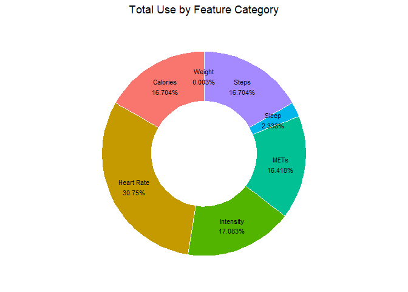
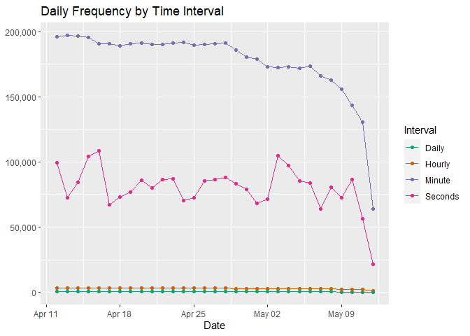
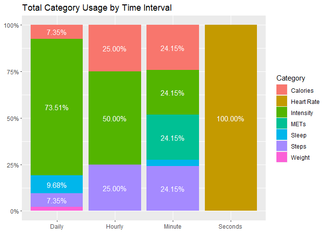
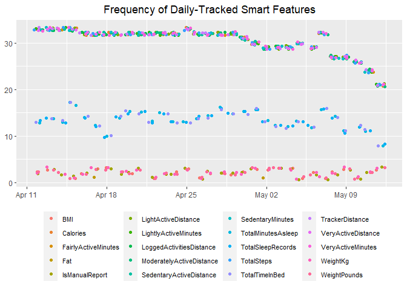
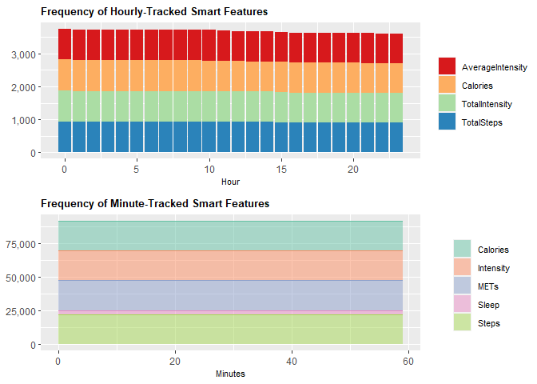

Bellabeat Case Study
================
Leopoldine Mirtil

### Disclaimer

This analysis was made as part of the *Bellabeat Case Study: How Can a
Wellness Technology Company Play It Smart?*, offered through the Google
Data Analytics Certificate program on Coursera.com. The data is from the
[FitBit Fitness Tracker
Data](https://www.kaggle.com/datasets/arashnic/fitbit?resource=download)
and was originally uploaded to Kaggle.com by the user Möbius for public
use. The data covers one month of collection from 4/12/2016 to 5/12/2016
from over 30 consenting users.

## Introduction

#### Scenario

You are a junior data analyst working on the marketing analyst team at
Bellabeat, a high-tech manufacturer of health-focused products for
women. Bellabeat is a successful small company, but they have the
potential to become a larger player in the global smart device market.
Urška Sršen, cofounder and Chief Creative Officer of Bellabeat, believes
that analyzing smart device fitness data could help unlock new growth
opportunities for the company. You have been asked to focus on one of
Bellabeat’s products and analyze smart device data to gain insight into
how consumers are using their smart devices. The insights you discover
will then help guide marketing strategy for the company. You will
present your analysis to the Bellabeat executive team along with your
high-level recommendations for Bellabeat’s marketing strategy.

#### Products

- **Bellabeat** **app:** The Bellabeat app provides users with health
  data related to their activity, sleep, stress, menstrual cycle, and
  mindfulness habits. This data can help users better understand their
  current habits and make healthy decisions. The Bellabeat app connects
  to their line of smart wellness products.

- **Leaf:** Bellabeat’s classic wellness tracker can be worn as a
  bracelet, necklace, or clip. The Leaf tracker connects to the
  Bellabeat app to track activity, sleep, and stress.

- **Time:** This wellness watch combines the timeless look of a classic
  timepiece with smart technology to track user activity, sleep, and
  stress. The Time watch connects to the Bellabeat app to provide you
  with insights into your daily wellness.

- **Spring:** This is a water bottle that tracks daily water intake
  using smart technology to ensure that you are appropriately hydrated
  throughout the day. The Spring bottle connects to the Bellabeat app to
  track your hydration levels.

- **Bellabeat** **membership:** Bellabeat also offers a
  subscription-based membership program for users. Membership gives
  users 24/7 access to fully personalized guidance on nutrition,
  activity, sleep, health and beauty, and mindfulness based on their
  lifestyle and goals.

### Objective

Sršen asks you to analyze smart device usage data in order to gain
insight into how consumers use non-Bellabeat smart devices. She then
wants you to select one Bellabeat product to apply these insights to in
your presentation.

1.  What are some trends in smart device usage?
2.  How could these trends apply to Bellabeat customers?
3.  How could these trends help influence Bellabeat marketing strategy?

## Get to Work

### Step 1 - Import Data

#### Load Packages

``` r
library(tidyr)
library(tidyverse)
library(dplyr)
library(knitr)
library(lubridate)
library(chron)
library(pastecs)
library(ggplot2)
library(cowplot)
```

#### Set Directory & Import Data

``` r
setwd('C:/Users/Leopoldine/Desktop/Mine/Coding Projects & Portfolio/Bellabeat/00_raw_data')

dailyActs <- read.csv('dailyActivity_merged.csv')
dailyCals <- read.csv('dailyCalories_merged.csv')
dailyInts <- read.csv('dailyIntensities_merged.csv')
dailySteps <- read.csv('dailySteps_merged.csv')
hrate_sec <- read.csv('heartrate_seconds_merged.csv')
hrCals <- read.csv('hourlyCalories_merged.csv')
hrInts <- read.csv('hourlyIntensities_merged.csv')
hrSteps <- read.csv('hourlySteps_merged.csv')
minCalsN <- read.csv('minuteCaloriesNarrow_merged.csv')  
minIntsN <- read.csv('minuteIntensitiesNarrow_merged.csv')
minMETsN <- read.csv('minuteMETsNarrow_merged.csv')
minSleep <- read.csv('minuteSleep_merged.csv')
minStepsN <- read.csv('minuteStepsNarrow_merged.csv')
sleepDay <- read.csv('sleepDay_merged.csv')
weightLog <- read.csv('weightLogInfo_merged.csv')
```

### Step 2 - Clean Data

#### Daily: Compare Dataframes

``` r
##dailyActs vs dailyCals
# TRUE = equal, False=not equal
all.equal(dailyActs$Calories, dailyCals$Calories) 
```

    ## [1] TRUE

``` r
all.equal(dailyActs$Id, dailyCals$Id)
```

    ## [1] TRUE

``` r
all.equal(dailyActs$ActivityDate, dailyCals$ActivityDay)
```

    ## [1] TRUE

``` r
##dailyActs vs dailySteps
all.equal(dailyActs$TotalSteps, dailySteps$StepTotal) 
```

    ## [1] TRUE

``` r
all.equal(dailyActs$Id, dailySteps$Id)
```

    ## [1] TRUE

``` r
all.equal(dailyActs$ActivityDate, dailySteps$ActivityDay)
```

    ## [1] TRUE

``` r
#dailyActs vs dailyInts
all.equal(dailyActs$Id, dailyInts$Id)
```

    ## [1] TRUE

``` r
all.equal(dailyActs$ActivityDate, dailyInts$ActivityDay)
```

    ## [1] TRUE

``` r
#dailyActs vs dailyInts
##convert columns of both dfs  into data tables for comparison (both have diff col orders)
d_Acts <- data.table::setDT(dailyActs[7:14])
d_Ints <- data.table::setDT(dailyInts[3:10])

all.equal(d_Acts, d_Ints, ignore.col.order = TRUE)
```

    ## [1] TRUE

``` r
#compare similar columns 'TotalDistance' vs 'TrackerDistance'
tod <- data.table::setDT(dailyActs[5])
trd <- data.table::setDT(dailyActs[6])

all.equal(tod, trd)
```

    ## [1] "Different column names"

``` r
#remove a 'TotalDistance' column
dailyActs <- select(dailyActs, -c(TotalDistance))
```

#### Daily: Convert Data Type of Column

``` r
#change to date for later merging
dailyActs$ActivityDate <- as.Date(dailyActs$ActivityDate, '%m/%d/%Y') 
```

#### Hourly: Compare Hourly Dataframes

``` r
#check Id columns
all.equal(hrCals$Id, hrInts$Id)
```

    ## [1] TRUE

``` r
all.equal(hrSteps$Id, hrInts$Id)
```

    ## [1] TRUE

``` r
#check Activity columns
all.equal(hrCals$ActivityHour, hrInts$ActivityHour)
```

    ## [1] TRUE

``` r
all.equal(hrSteps$ActivityHour, hrInts$ActivityHour)
```

    ## [1] TRUE

#### Merge Hourly Dataframes

``` r
hourlyActs <- bind_cols(hrCals, hrSteps[3], hrInts[3:4])

# view data
str(hourlyActs)
```

    ## 'data.frame':    22099 obs. of  6 variables:
    ##  $ Id              : num  1503960366 1503960366 1503960366 1503960366 1503960366 ...
    ##  $ ActivityHour    : chr  "4/12/2016 12:00:00 AM" "4/12/2016 1:00:00 AM" "4/12/2016 2:00:00 AM" "4/12/2016 3:00:00 AM" ...
    ##  $ Calories        : int  81 61 59 47 48 48 48 47 68 141 ...
    ##  $ StepTotal       : int  373 160 151 0 0 0 0 0 250 1864 ...
    ##  $ TotalIntensity  : int  20 8 7 0 0 0 0 0 13 30 ...
    ##  $ AverageIntensity: num  0.333 0.133 0.117 0 0 ...

#### Minute: Compare Dataframes

``` r
# check Id&ActivityMinute columns 
all.equal(minCalsN[1:2],minStepsN[1:2])
```

    ## [1] TRUE

``` r
all.equal(minIntsN[1:2],minMETsN[1:2])
```

    ## [1] TRUE

``` r
all.equal(minCalsN[1:2],minMETsN[1:2])
```

    ## [1] TRUE

#### Merge Minute-Narrow Dataframes

``` r
minActs <- bind_cols(minCalsN, minStepsN[3], minIntsN[3], minMETsN[3])

str(minActs) 
```

    ## 'data.frame':    1325580 obs. of  6 variables:
    ##  $ Id            : num  1503960366 1503960366 1503960366 1503960366 1503960366 ...
    ##  $ ActivityMinute: chr  "4/12/2016 12:00:00 AM" "4/12/2016 12:01:00 AM" "4/12/2016 12:02:00 AM" "4/12/2016 12:03:00 AM" ...
    ##  $ Calories      : num  0.786 0.786 0.786 0.786 0.786 ...
    ##  $ Steps         : int  0 0 0 0 0 0 0 0 0 0 ...
    ##  $ Intensity     : int  0 0 0 0 0 0 0 0 0 0 ...
    ##  $ METs          : int  10 10 10 10 10 12 12 12 12 12 ...

### Step 3 - Modify Data

#### Rename Columns

``` r
dailyActs <- rename(dailyActs, DailyActsDate=ActivityDate, DailyId=Id)
sleepDay <- rename(sleepDay, DateTime=SleepDay, SleepDayId=Id)
hourlyActs <- rename(hourlyActs, DateTime=ActivityHour, TotalSteps=StepTotal, HourlyId=Id)
hrate_sec <- rename(hrate_sec, HRateId=Id, DateTime=Time, HeartRate=Value)
minActs <- rename(minActs, MinActsId=Id, DateTime=ActivityMinute)
minSleep <- rename(minSleep, MinSleepId=Id, DateTime=date, Sleep=value)
weightLog <- rename(weightLog, WeightId=Id, DateTime=Date)
```

#### Remove Columns

``` r
minSleep <- select(minSleep, -c(logId))
weightLog <- select(weightLog, -c(LogId))
```

#### Convert Logical Values to Integers

``` r
weightLog$IsManualReport <- as.integer(as.logical(weightLog$IsManualReport))
```

#### Add New Columns

##### Add Date-Only Columns

``` r
hourlyActs$HourlyDate <- as.Date(hourlyActs$DateTime, '%m/%d/%Y')
minActs$MinuteDate <- as.Date(minActs$DateTime, '%m/%d/%Y')
minSleep$MinSleepDate <- as.Date(minSleep$DateTime, '%m/%d/%Y')
sleepDay$SleepDate <- as.Date(sleepDay$DateTime, '%m/%d/%Y')
weightLog$WeightDate <- as.Date(weightLog$DateTime, '%m/%d/%Y')
hrate_sec$HRateDate <- as.Date(hrate_sec$DateTime, '%m/%d/%Y')
```

##### Add Time-Only Columns

``` r
hourlyActs$Hour <- chron(times.=(format(strptime(hourlyActs$DateTime, '%m/%d/%Y %r'), '%H:%M:%S')))
minActs$Minutes<- chron(times.=(format(strptime(minActs$DateTime, '%m/%d/%Y %r'), '%H:%M:%S')))
minSleep$SleepMinutes <- chron(times.=(format(strptime(minSleep$DateTime, '%m/%d/%Y %r'), '%H:%M:%S')))
sleepDay$SleepTime <- chron(times.=(format(strptime(sleepDay$DateTime, '%m/%d/%Y %r'), '%H:%M:%S')))
weightLog$WeightTime <- chron(times.=(format(strptime(weightLog$DateTime, '%m/%d/%Y %r'), '%H:%M:%S')))
hrate_sec$HRateTime <- chron(times.=(format(strptime(hrate_sec$DateTime, '%m/%d/%Y %r'), '%H:%M:%S')))
dailyActs$Time <- chron(times.=(as.numeric(NA))) 
```

#### Remove DateTime Columns

``` r
hourlyActs <- select(hourlyActs, -c(DateTime))
minSleep <- select(minSleep, -c(DateTime))
weightLog <- select(weightLog, -c(DateTime))
minActs <-select(minActs, -c(DateTime))
sleepDay <- select(sleepDay, -c(DateTime))
hrate_sec <- select(hrate_sec, -c(DateTime))
```

#### Reorganize Columns

``` r
hourlyActs <- hourlyActs[, c(1, 6, 7, 2:5)]
minActs <- minActs[, c(1, 6, 7, 2:5)]
minSleep <- minSleep[, c(1, 3, 4, 2)]
sleepDay <- sleepDay[, c(1, 5, 6, 2:4)]
weightLog <- weightLog[, c(1, 7, 8, 2:6)]
hrate_sec <- hrate_sec[, c(1, 3, 4, 2)]
dailyActs <- dailyActs[, c(1, 2, 15, 14, 3:13)] 
```

#### Add Suffix to Column Values

``` r
library(datawizard)

#add suffixes to smart features valuesmatch time intervals of dfs and for later analysis
dailyActs <- data_addsuffix(dailyActs,"_Daily", Calories:SedentaryMinutes)
minActs <- data_addsuffix(minActs,"_Minute", Calories:METs)
minSleep <- data_addsuffix(minSleep ,"_Minute", Sleep)
sleepDay <- data_addsuffix(sleepDay,"_Daily", TotalSleepRecords:TotalTimeInBed)
hourlyActs <- data_addsuffix(hourlyActs,"_Hourly", Calories:AverageIntensity)
weightLog <- data_addsuffix(weightLog,"_Daily", WeightKg:IsManualReport)
hrate_sec <- data_addsuffix(hrate_sec,"_Seconds", HeartRate)
```

#### Confirm Date Ranges

``` r
#dates should be w/i range (4/12 - 5/12/2016)
range(dailyActs$DailyActsDate)
```

    ## [1] "2016-04-12" "2016-05-12"

``` r
range(hourlyActs$HourlyDate) 
```

    ## [1] "2016-04-12" "2016-05-12"

``` r
range(minActs$MinuteDate)
```

    ## [1] "2016-04-12" "2016-05-12"

``` r
range(minSleep$MinSleepDate) 
```

    ## [1] "2016-04-11" "2016-05-12"

``` r
range(sleepDay$SleepDate) 
```

    ## [1] "2016-04-12" "2016-05-12"

``` r
range(weightLog$WeightDate) 
```

    ## [1] "2016-04-12" "2016-05-12"

``` r
range(hrate_sec$HRateDate)  
```

    ## [1] "2016-04-12" "2016-05-12"

#### Remove Out of Range Dates

``` r
minSleep <- minSleep[minSleep[['MinSleepDate']]>='2016-04-12', ] 
```

#### Merge Dataframes

``` r
#join dailyActs & sleepDay datsets by Id & date as keys
daily <- full_join(dailyActs, sleepDay, by=join_by(DailyId==SleepDayId, DailyActsDate==SleepDate), keep=TRUE) # keep=TRUE keeps matching cols

gc()
```

``` r
# join daily data and hourly dataset
## merge smaller dataset to larger data set to keep order in Id, Date and Time
daily_hour <- full_join(daily, hourlyActs, by=join_by(DailyId==HourlyId, DailyActsDate==HourlyDate, SleepTime==Hour), keep=TRUE) 

# clear previous joined files
rm(daily, hourlyActs, dailyActs, sleepDay)
gc()
```

``` r
# join minute datasets together
minutes <- full_join(minActs, minSleep, by=join_by(MinActsId==MinSleepId, MinuteDate==MinSleepDate, Minutes==SleepMinutes), keep=TRUE)

rm(minActs, minSleep)
gc()

# combine daily_hour &  minutes; use hour as next longest available time format
d_hr_min <- full_join(daily_hour, minutes, by=join_by(DailyId==MinActsId, DailyActsDate==MinuteDate, Hour==Minutes), keep=TRUE)
rm(daily_hour, minutes)
gc()

# join d_hr_min + hrate_sec
smarties <- full_join(d_hr_min, hrate_sec, by=join_by(DailyId==HRateId, DailyActsDate==HRateDate, Minutes==HRateTime), keep=TRUE) 

# join smarties + weight Log
smart <- full_join(smarties, weightLog, by=join_by(DailyId==WeightId, DailyActsDate==WeightDate, HRateTime==WeightTime), keep=TRUE) 

#clear environment
rm(smarties, d_hr_min, hrate_sec, weightLog) 
gc()
```

### Step 4 - Further Modify Combined Dataset

#### Create Primary Id Column

``` r
#new copy in case of error
smartDev <- smart 

smartDev$DailyId <- ifelse(is.na(smartDev$DailyId), smartDev$MinActsId, smartDev$DailyId)
smartDev$DailyId <- ifelse(is.na(smartDev$DailyId), smartDev$HourlyId, smartDev$DailyId)
smartDev$DailyId <- ifelse(is.na(smartDev$DailyId), smartDev$HRateId, smartDev$DailyId)
smartDev$DailyId <- ifelse(is.na(smartDev$DailyId), smartDev$MinSleepId, smartDev$DailyId)
smartDev$DailyId <- ifelse(is.na(smartDev$DailyId), smartDev$WeightId, smartDev$DailyId)


## confirm no more NA values 
sum(is.na(smartDev$DailyId))
```

    ## [1] 0

``` r
# remove other Id columns
smartDev <- select(smartDev, -c(SleepDayId, HourlyId, MinActsId, HRateId, WeightId, MinSleepId))
```

#### Create Primary Date Column

``` r
#use other date cols to fill blanks in 'DailyActsDate'
smartDev <- 
  smartDev %>% 
    mutate(DailyActsDate=coalesce(DailyActsDate, SleepDate)) %>%
    mutate(DailyActsDate=coalesce(DailyActsDate, MinuteDate)) %>%
    mutate(DailyActsDate=coalesce(DailyActsDate, HourlyDate)) %>%
    mutate(DailyActsDate=coalesce(DailyActsDate, HRateDate)) %>%
    mutate(DailyActsDate=coalesce(DailyActsDate, MinSleepDate)) %>%
    mutate(DailyActsDate=coalesce(DailyActsDate, WeightDate))

## confirm no more NA values 
sum(is.na(smartDev$DailyActsDate))
```

    ## [1] 0

``` r
# remove other date columns
smartDev <- select(smartDev, -c(SleepDate, HourlyDate, MinuteDate, MinSleepDate, HRateDate, WeightDate))
```

#### Create Primary Time Column

``` r
#fill blanks of Time column w/other time cols
smartDev <- 
  smartDev %>% 
    mutate(Time=coalesce(Time, SleepTime)) %>% 
    mutate(Time=coalesce(Time, Minutes)) %>% 
    mutate(Time=coalesce(Time, Hour)) %>% 
    mutate(Time=coalesce(Time, HRateTime)) %>% 
    mutate(Time=coalesce(Time, SleepMinutes)) %>% 
    mutate(Time=coalesce(Time, WeightTime))

# remove columns
smartDev <- select(smartDev, -c(SleepTime, Hour, Minutes, SleepMinutes, HRateTime, WeightTime))
```

#### Clean up Modified Dataframe

``` r
#Rename columns
smartDev <- rename(smartDev, Id=DailyId, Date=DailyActsDate)

# clear environment
rm(smart)
gc()
```

#### View Merged Dataframe

``` r
str(smartDev)
```

    ## 'data.frame':    3893669 obs. of  33 variables:
    ##  $ Id                            : num  1503960366 1503960366 1503960366 1503960366 1503960366 ...
    ##  $ Date                          : Date, format: "2016-04-12" "2016-04-13" ...
    ##  $ Time                          : 'times' num  00:00:00 00:00:00 NA 00:00:00 00:00:00 00:00:00 NA 00:00:00 00:00:00 00:00:00 ...
    ##   ..- attr(*, "format")= chr "h:m:s"
    ##  $ Calories_Daily                : int  1985 1797 1776 1745 1863 1728 1921 2035 1786 1775 ...
    ##  $ TotalSteps_Daily              : int  13162 10735 10460 9762 12669 9705 13019 15506 10544 9819 ...
    ##  $ TrackerDistance_Daily         : num  8.5 6.97 6.74 6.28 8.16 ...
    ##  $ LoggedActivitiesDistance_Daily: num  0 0 0 0 0 0 0 0 0 0 ...
    ##  $ VeryActiveDistance_Daily      : num  1.88 1.57 2.44 2.14 2.71 ...
    ##  $ ModeratelyActiveDistance_Daily: num  0.55 0.69 0.4 1.26 0.41 ...
    ##  $ LightActiveDistance_Daily     : num  6.06 4.71 3.91 2.83 5.04 ...
    ##  $ SedentaryActiveDistance_Daily : num  0 0 0 0 0 0 0 0 0 0 ...
    ##  $ VeryActiveMinutes_Daily       : int  25 21 30 29 36 38 42 50 28 19 ...
    ##  $ FairlyActiveMinutes_Daily     : int  13 19 11 34 10 20 16 31 12 8 ...
    ##  $ LightlyActiveMinutes_Daily    : int  328 217 181 209 221 164 233 264 205 211 ...
    ##  $ SedentaryMinutes_Daily        : int  728 776 1218 726 773 539 1149 775 818 838 ...
    ##  $ TotalSleepRecords_Daily       : int  1 2 NA 1 2 1 NA 1 1 1 ...
    ##  $ TotalMinutesAsleep_Daily      : int  327 384 NA 412 340 700 NA 304 360 325 ...
    ##  $ TotalTimeInBed_Daily          : int  346 407 NA 442 367 712 NA 320 377 364 ...
    ##  $ Calories_Hourly               : int  81 69 NA 60 77 47 NA 47 54 54 ...
    ##  $ TotalSteps_Hourly             : int  373 144 NA 83 459 0 NA 0 16 17 ...
    ##  $ TotalIntensity_Hourly         : int  20 14 NA 6 15 0 NA 0 2 2 ...
    ##  $ AverageIntensity_Hourly       : num  0.333 0.233 NA 0.1 0.25 ...
    ##  $ Calories_Minute               : num  0.786 1.888 NA 0.944 4.09 ...
    ##  $ Steps_Minute                  : int  0 4 NA 0 77 0 NA 0 0 0 ...
    ##  $ Intensity_Minute              : int  0 1 NA 0 2 0 NA 0 0 0 ...
    ##  $ METs_Minute                   : int  10 24 NA 12 52 10 NA 10 12 12 ...
    ##  $ Sleep_Minute                  : int  NA NA NA NA NA 1 NA NA NA NA ...
    ##  $ HeartRate_Seconds             : int  NA NA NA NA NA NA NA NA NA NA ...
    ##  $ WeightKg_Daily                : num  NA NA NA NA NA NA NA NA NA NA ...
    ##  $ WeightPounds_Daily            : num  NA NA NA NA NA NA NA NA NA NA ...
    ##  $ Fat_Daily                     : int  NA NA NA NA NA NA NA NA NA NA ...
    ##  $ BMI_Daily                     : num  NA NA NA NA NA NA NA NA NA NA ...
    ##  $ IsManualReport_Daily          : int  NA NA NA NA NA NA NA NA NA NA ...

### Step 5 - Final Manipulation of Dataframes

#### Pivot Smart Features Dataframe

``` r
# create new df in case of error
smart_d2 <- smartDev

#transpose data 
mod_smart <- 
smart_d2 %>%
  pivot_longer(cols=c(Calories_Daily:IsManualReport_Daily), 
               names_to = 'SmartFeatures', 
               values_to = 'Values', 
               values_drop_na = TRUE)

#view pivoted data
head(mod_smart) 
```

    ## # A tibble: 6 × 5
    ##           Id Date       Time     SmartFeatures                     Values
    ##        <dbl> <date>     <times>  <chr>                              <dbl>
    ## 1 1503960366 2016-04-12 00:00:00 Calories_Daily                  1985    
    ## 2 1503960366 2016-04-12 00:00:00 TotalSteps_Daily               13162    
    ## 3 1503960366 2016-04-12 00:00:00 TrackerDistance_Daily              8.5  
    ## 4 1503960366 2016-04-12 00:00:00 LoggedActivitiesDistance_Daily     0    
    ## 5 1503960366 2016-04-12 00:00:00 VeryActiveDistance_Daily           1.88 
    ## 6 1503960366 2016-04-12 00:00:00 ModeratelyActiveDistance_Daily     0.550

#### Create Interval Column

``` r
#removed suffixes from SmartFeatures values to create new col
mod_smart <-
mod_smart %>%
  separate_wider_delim(SmartFeatures, "_", names=c('SmartFeatures', 'Interval'))

head(mod_smart)
```

    ## # A tibble: 6 × 6
    ##           Id Date       Time     SmartFeatures            Interval    Values
    ##        <dbl> <date>     <times>  <chr>                    <chr>        <dbl>
    ## 1 1503960366 2016-04-12 00:00:00 Calories                 Daily     1985    
    ## 2 1503960366 2016-04-12 00:00:00 TotalSteps               Daily    13162    
    ## 3 1503960366 2016-04-12 00:00:00 TrackerDistance          Daily        8.5  
    ## 4 1503960366 2016-04-12 00:00:00 LoggedActivitiesDistance Daily        0    
    ## 5 1503960366 2016-04-12 00:00:00 VeryActiveDistance       Daily        1.88 
    ## 6 1503960366 2016-04-12 00:00:00 ModeratelyActiveDistance Daily        0.550

#### Add Category Column

``` r
#group related features into categories for new col
mod_smart$Category <- with(mod_smart, ifelse(SmartFeatures == "Calories", 'Calories',
                            ifelse(SmartFeatures == "METs", 'METs',
                            ifelse(SmartFeatures == "Sleep" |SmartFeatures =="TotalSleepRecords"
                                   |SmartFeatures =="TotalMinutesAsleep"
                                   |SmartFeatures =="TotalTimeInBed", 'Sleep', 
                            ifelse(SmartFeatures == "Steps" |SmartFeatures =="TotalSteps", 'Steps', 
                            ifelse(SmartFeatures == "WeightKg"|SmartFeatures =="WeightPounds"
                                   |SmartFeatures =="Fat"|SmartFeatures =="BMI"
                                   |SmartFeatures =="IsManualReport", 'Weight', 
                            ifelse(SmartFeatures =="HeartRate", 'Heart Rate', 'Intensity')))))))
```

#### Reorganize Columns

``` r
mod_smart <- mod_smart[, c(1:4, 6, 7, 5)] 
head(mod_smart)
```

    ## # A tibble: 6 × 7
    ##           Id Date       Time     SmartFeatures          Values Category Interval
    ##        <dbl> <date>     <times>  <chr>                   <dbl> <chr>    <chr>   
    ## 1 1503960366 2016-04-12 00:00:00 Calories              1.99e+3 Calories Daily   
    ## 2 1503960366 2016-04-12 00:00:00 TotalSteps            1.32e+4 Steps    Daily   
    ## 3 1503960366 2016-04-12 00:00:00 TrackerDistance       8.5 e+0 Intensi… Daily   
    ## 4 1503960366 2016-04-12 00:00:00 LoggedActivitiesDist… 0       Intensi… Daily   
    ## 5 1503960366 2016-04-12 00:00:00 VeryActiveDistance    1.88e+0 Intensi… Daily   
    ## 6 1503960366 2016-04-12 00:00:00 ModeratelyActiveDist… 5.50e-1 Intensi… Daily

#### Export Final Modified Files

``` r
setwd('C:/Users/Leopoldine/Desktop/Mine/Coding Projects & Portfolio/Bellabeat/01_tidy_data')

write.csv(mod_smart, 'mod_smart.csv', row.names = FALSE)
```

### Step 5 - Analyze Data

#### Descriptive Analysis of Smart Features

``` r
round(stat.desc(mod_smart), 2)
```

    ##                                  Id            Date       Time SmartFeatures
    ## nbr.val                  8077043.00      8077043.00 8070683.00            NA
    ## nbr.null                       0.00            0.00   14024.00            NA
    ## nbr.na                         0.00            0.00    6360.00            NA
    ## min                   1503960366.00        16903.00       0.00            NA
    ## max                   8877689391.00        16933.00       1.00            NA
    ## range                 7373729025.00           30.00       1.00            NA
    ## sum            40839429581798520.00 136640198476.00 4065016.41            NA
    ## median                4702921684.00        16917.00       0.51            NA
    ## mean                  5056235256.12        16917.11       0.50            NA
    ## SE.mean                   809086.64            0.00       0.00            NA
    ## CI.mean.0.95             1585780.92            0.01       0.00            NA
    ## var          5287403540259544064.00           74.78       0.08            NA
    ## std.dev               2299435482.95            8.65       0.28            NA
    ## coef.var                       0.45            0.00       0.56            NA
    ##                    Values Category Interval
    ## nbr.val        8077043.00       NA       NA
    ## nbr.null       2270097.00       NA       NA
    ## nbr.na               0.00       NA       NA
    ## min                  0.00       NA       NA
    ## max              36019.00       NA       NA
    ## range            36019.00       NA       NA
    ## sum          241703468.86       NA       NA
    ## median               8.00       NA       NA
    ## mean                29.92       NA       NA
    ## SE.mean              0.04       NA       NA
    ## CI.mean.0.95         0.08       NA       NA
    ## var              13543.45       NA       NA
    ## std.dev            116.38       NA       NA
    ## coef.var             3.89       NA       NA

#### Smart Features User Count

``` r
mod_smart %>%
  group_by(SmartFeatures)%>%
  summarise(UserCount=length(unique(Id))) %>%
  arrange(desc(UserCount)) %>%
  print(n=27)
```

    ## # A tibble: 27 × 2
    ##    SmartFeatures            UserCount
    ##    <chr>                        <int>
    ##  1 AverageIntensity                33
    ##  2 Calories                        33
    ##  3 FairlyActiveMinutes             33
    ##  4 Intensity                       33
    ##  5 LightActiveDistance             33
    ##  6 LightlyActiveMinutes            33
    ##  7 LoggedActivitiesDistance        33
    ##  8 METs                            33
    ##  9 ModeratelyActiveDistance        33
    ## 10 SedentaryActiveDistance         33
    ## 11 SedentaryMinutes                33
    ## 12 Steps                           33
    ## 13 TotalIntensity                  33
    ## 14 TotalSteps                      33
    ## 15 TrackerDistance                 33
    ## 16 VeryActiveDistance              33
    ## 17 VeryActiveMinutes               33
    ## 18 Sleep                           24
    ## 19 TotalMinutesAsleep              24
    ## 20 TotalSleepRecords               24
    ## 21 TotalTimeInBed                  24
    ## 22 HeartRate                       14
    ## 23 BMI                              8
    ## 24 IsManualReport                   8
    ## 25 WeightKg                         8
    ## 26 WeightPounds                     8
    ## 27 Fat                              2

#### Total Use Count

##### Feature Category Usage

``` r
mod_smart %>%
  group_by(Category) %>%
  summarise(Total=n()) %>%
  arrange(desc(Total)) 
```

    ## # A tibble: 7 × 2
    ##   Category     Total
    ##   <chr>        <int>
    ## 1 Heart Rate 2483659
    ## 2 Intensity  1379785
    ## 3 Calories   1349176
    ## 4 Steps      1349176
    ## 5 METs       1326127
    ## 6 Sleep       188850
    ## 7 Weight         270

##### Smart Features Usage by Category

``` r
mod_smart %>%
  group_by(Category, SmartFeatures)%>%
  summarise(Count=n()) %>%
  arrange(Category, desc(Count)) %>%
  print(n=27)
```

    ## # A tibble: 27 × 3
    ## # Groups:   Category [7]
    ##    Category   SmartFeatures              Count
    ##    <chr>      <chr>                      <int>
    ##  1 Calories   Calories                 1349176
    ##  2 Heart Rate HeartRate                2483659
    ##  3 Intensity  Intensity                1326127
    ##  4 Intensity  AverageIntensity           22104
    ##  5 Intensity  TotalIntensity             22104
    ##  6 Intensity  FairlyActiveMinutes          945
    ##  7 Intensity  LightActiveDistance          945
    ##  8 Intensity  LightlyActiveMinutes         945
    ##  9 Intensity  LoggedActivitiesDistance     945
    ## 10 Intensity  ModeratelyActiveDistance     945
    ## 11 Intensity  SedentaryActiveDistance      945
    ## 12 Intensity  SedentaryMinutes             945
    ## 13 Intensity  TrackerDistance              945
    ## 14 Intensity  VeryActiveDistance           945
    ## 15 Intensity  VeryActiveMinutes            945
    ## 16 METs       METs                     1326127
    ## 17 Sleep      Sleep                     187605
    ## 18 Sleep      TotalMinutesAsleep           415
    ## 19 Sleep      TotalSleepRecords            415
    ## 20 Sleep      TotalTimeInBed               415
    ## 21 Steps      Steps                    1326127
    ## 22 Steps      TotalSteps                 23049
    ## 23 Weight     BMI                           67
    ## 24 Weight     IsManualReport                67
    ## 25 Weight     WeightKg                      67
    ## 26 Weight     WeightPounds                  67
    ## 27 Weight     Fat                            2

##### Total Count by Interval

``` r
mod_smart %>%
  group_by(Interval) %>%
  summarise(Count=n()) %>%
  arrange(desc(Count))
```

    ## # A tibble: 4 × 2
    ##   Interval   Count
    ##   <chr>      <int>
    ## 1 Minute   5492113
    ## 2 Seconds  2483659
    ## 3 Hourly     88416
    ## 4 Daily      12855

##### Total Count by Category and Interval

``` r
mod_smart %>%
  group_by(Interval, Category) %>%
  summarise(Count=n()) %>%
  arrange(Interval, desc(Count))
```

    ## # A tibble: 14 × 3
    ## # Groups:   Interval [4]
    ##    Interval Category     Count
    ##    <chr>    <chr>        <int>
    ##  1 Daily    Intensity     9450
    ##  2 Daily    Sleep         1245
    ##  3 Daily    Calories       945
    ##  4 Daily    Steps          945
    ##  5 Daily    Weight         270
    ##  6 Hourly   Intensity    44208
    ##  7 Hourly   Calories     22104
    ##  8 Hourly   Steps        22104
    ##  9 Minute   Calories   1326127
    ## 10 Minute   Intensity  1326127
    ## 11 Minute   METs       1326127
    ## 12 Minute   Steps      1326127
    ## 13 Minute   Sleep       187605
    ## 14 Seconds  Heart Rate 2483659

#### Weekday Frequency of Feature Categories

``` r
mod_smart %>% 
  mutate(Weekday=wday(Date, label=TRUE)) %>%
  group_by(Weekday, Category) %>%
  summarise(TotalCount = n()) %>%
  arrange(Weekday, desc(TotalCount)) 
```

    ## # A tibble: 49 × 3
    ## # Groups:   Weekday [7]
    ##    Weekday Category   TotalCount
    ##    <ord>   <chr>           <int>
    ##  1 Sun     Heart Rate     287147
    ##  2 Sun     Intensity      180762
    ##  3 Sun     Calories       176777
    ##  4 Sun     Steps          176777
    ##  5 Sun     METs           173760
    ##  6 Sun     Sleep           28927
    ##  7 Sun     Weight             41
    ##  8 Mon     Heart Rate     289764
    ##  9 Mon     Intensity      178595
    ## 10 Mon     Calories       174644
    ## # ℹ 39 more rows

#### Top & Bottom 5 Used Features

``` r
mod_smart %>%
  group_by(SmartFeatures) %>%
  summarise(Total_Count=n()) %>%
  arrange(desc(Total_Count)) %>%
  slice(unique(c(1:5, n() - 4:0))) 
```

    ## # A tibble: 10 × 2
    ##    SmartFeatures  Total_Count
    ##    <chr>                <int>
    ##  1 HeartRate          2483659
    ##  2 Calories           1349176
    ##  3 Intensity          1326127
    ##  4 METs               1326127
    ##  5 Steps              1326127
    ##  6 BMI                     67
    ##  7 IsManualReport          67
    ##  8 WeightKg                67
    ##  9 WeightPounds            67
    ## 10 Fat                      2

### Step 6 - Visualizations

<!-- -->

The Heart Rate category saw the most use during the month-long period.
The Weight and Sleep categories saw less than 5% of use combined during
the period. Since the categories reflect their related smart features,
we can assume that the heart rate feature saw the most use during the
period while both weight-related and sleep-related features saw the
least.

<!-- -->

The highest frequency of use was recorded by minutes with over 150,000
uses steadily throughout most of the month. This shows that users
greatly preferred tracking their activities first by minute, then by
seconds compared to the other time intervals.

<!-- -->

The Intensity category saw the most daily use, while the Weight category
saw the least. The Hourly interval recorded use from 3 feature
categories, with the Intensity category made up half of the total use.
The Minute interval recorded use from 5 categories, with the Sleep
category recording the less than 4% of use. The only feature tracked
during seconds was heart rate. With the exception of Seconds, as the
time interval increased, so did the number of categories (and related
features) use among users.

<!-- -->

There are three distinct layers of frequency among the smart features
over the month. The Calories features and all the intensity-related
features had the highest daily use out of all of the daily-tracked
features. The bottom layer was made up of all of the weight-related
features and saw a daily use of less than 5.

<!-- -->

A consistent frequency under 1,000 uses every hour was recorded for the
hourly smart features. The four features that were recorded hourly saw
an equal amount of use from hours ‘0-23’. The Sleep feature had the
lowest frequency of use compared to the other four features recorded
every minute. The minute frequencies of these features had over 20,000
uses steadily from minutes ‘0-59’.

### Top Recommendations

**Drop Weight Features**

Bellabeat should consider removing or not developing any weight-related
features since the five least used features were all related to weight.
By shifting resources to other features that are actually popular among
users, the company would be able to better market their products and
attract potential customers.

**Develop Features Related to Most Popular Features**

Bellabeat should create features related to the top five most used
features (Heart Rate, Calories, Intensity, Steps and METs). For example,
the company could develop cardio-related features such as a blood
pressure recorder or pulse monitor to reflect the high use in the Heart
Rate feature. These new features could then be added to existing
Bellabeat products to the benefit of existing and potential customers.
The Time wellness watch would be the perfect product to add these new
features to.

**Track Features by Minutes/Seconds**

The company should ensure that their features can be tracked by the
minutes or seconds as the highest use were recorded during these time
intervals. Bellabeat can modify the Time wellness watch to allow users
to track features by their preferred time intervals which will also be
appealing to potential customers.
