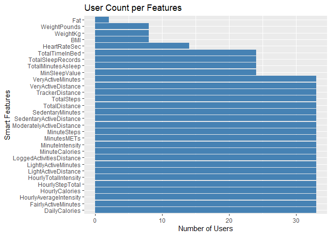
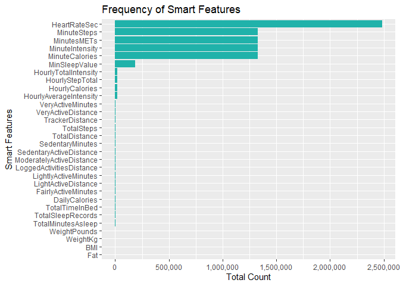
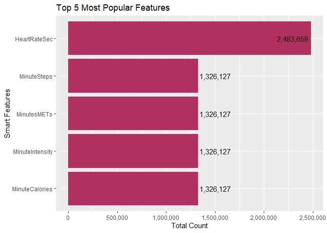
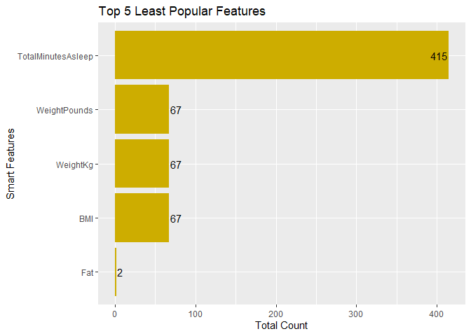
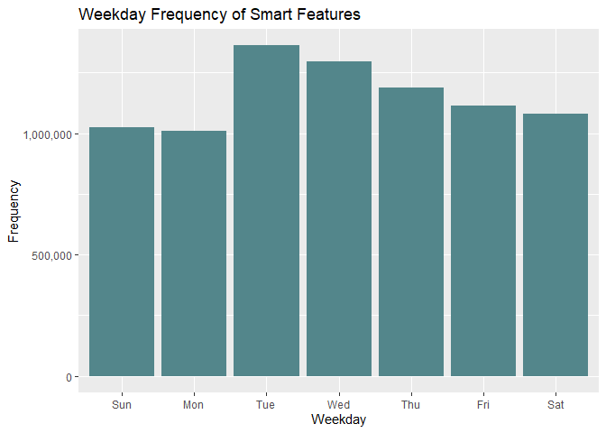
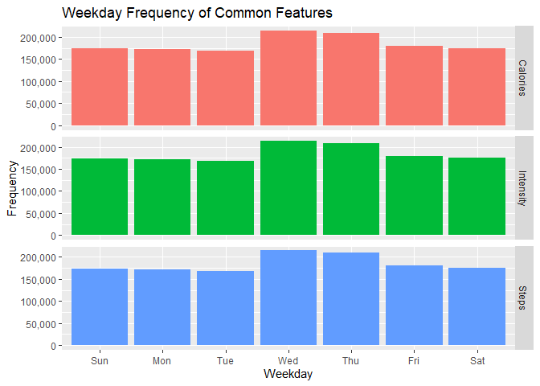
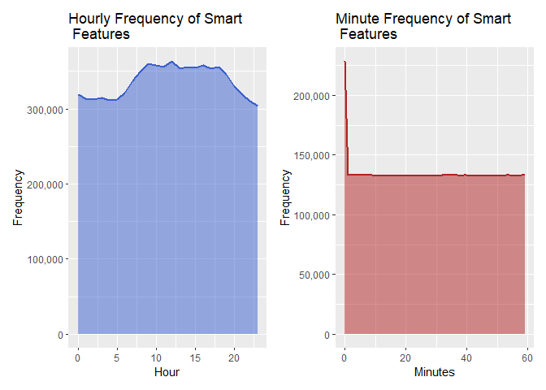
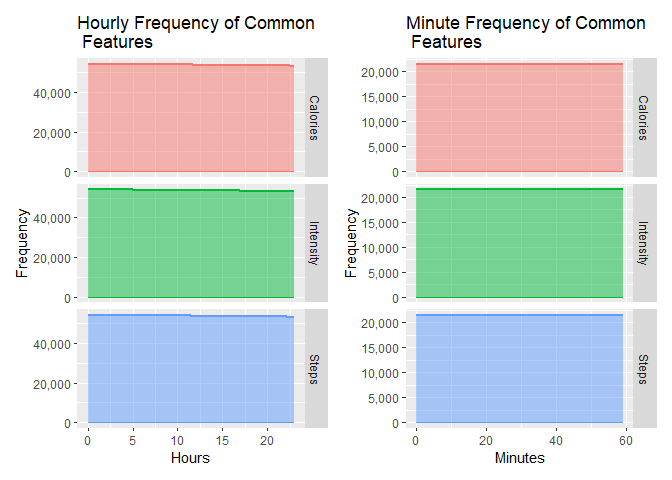

Bellabeat Case Study
================
Leopoldine Mirtil
2023-08-27

### Disclaimer

The data from this analysis is from the Bellabeat Case Study: How Can a
Wellness Technology Company Play It Smart?, as part of the Google Data
Analytics Certificate Capstone Project. The data was part of the [FitBit
Fitness Tracker
Data](https://www.kaggle.com/datasets/arashnic/fitbit?resource=download),
made publicly available by the user Möbius on Kaggle.com. The data
covers one month of collection from 4/12/2016 to 5/12/2016 from over 30
consenting users.

## Introduction

#### Scenario

You are a junior data analyst working on the marketing analyst team at
Bellabeat, a high-tech manufacturer of health-focused products for
women. Bellabeat is a successful small company, but they have the
potential to become a larger player in the global smart device market.
Urška Sršen, cofounder and Chief Creative Officer of Bellabeat, believes
that analyzing smart device fitness data could help unlock new growth
opportunities for the company. You have been asked to focus on one of
Bellabeat’s products and analyze smart device data to gain insight into
how consumers are using their smart devices. The insights you discover
will then help guide marketing strategy for the company. You will
present your analysis to the Bellabeat executive team along with your
high-level recommendations for Bellabeat’s marketing strategy.

#### Stakeholders & Products

- **Stakeholders**

  - **Urška** **Sršen:** Bellabeat’s cofounder and Chief Creative
    Officer

  - **Sando** **Mur:** Mathematician and Bellabeat’s cofounder; key
    member of the Bellabeat executive team

  - **Bellabeat** **marketing** **analytics** **team:** A team of data
    analysts responsible for collecting, analyzing, and reporting data
    that helps guide Bellabeat’s marketing strategy. You joined this
    team six months ago and have been busy learning about Bellabeat’’s
    mission and business goals — as well as how you, as a junior data
    analyst, can help Bellabeat achieve them.

- **Products**

  - **Bellabeat** **app:** The Bellabeat app provides users with health
    data related to their activity, sleep, stress, menstrual cycle, and
    mindfulness habits. This data can help users better understand their
    current habits and make healthy decisions. The Bellabeat app
    connects to their line of smart wellness products.

  - **Leaf:** Bellabeat’s classic wellness tracker can be worn as a
    bracelet, necklace, or clip. The Leaf tracker connects to the
    Bellabeat app to track activity, sleep, and stress.

  - **Time:** This wellness watch combines the timeless look of a
    classic timepiece with smart technology to track user activity,
    sleep, and stress. The Time watch connects to the Bellabeat app to
    provide you with insights into your daily wellness.

  - **Spring:** This is a water bottle that tracks daily water intake
    using smart technology to ensure that you are appropriately hydrated
    throughout the day. The Spring bottle connects to the Bellabeat app
    to track your hydration levels.

#### Tasks

1.  What are some trends in smart device usage?
2.  How could these trends apply to Bellabeat customers?
3.  How could these trends help influence Bellabeat marketing strategy?

## Get Started

### Step 1 - Import Data

#### Load Packages

``` r
library(tidyr)
library(tidyverse)
library(dplyr)
library(knitr)
library(lubridate)
library(chron)
library(pastecs)
library(ggplot2)
```

#### Remove Scientific Notation Format

``` r
options(scipen = 50) 
```

#### Set Directory & Import Data

``` r
setwd('C:/Users/Leopoldine/Desktop/Mine/Coding Projects & Portfolio/Bellabeat Case Study/00_raw_data')

dailyActs <- read.csv('dailyActivity_merged.csv')
dailyCals <- read.csv('dailyCalories_merged.csv')
dailyInts <- read.csv('dailyIntensities_merged.csv')
dailySteps <- read.csv('dailySteps_merged.csv')
hrate_sec <- read.csv('heartrate_seconds_merged.csv')
hrCals <- read.csv('hourlyCalories_merged.csv')
hrInts <- read.csv('hourlyIntensities_merged.csv')
hrSteps <- read.csv('hourlySteps_merged.csv')
minCalsN <- read.csv('minuteCaloriesNarrow_merged.csv')  
minCalsW <- read.csv('minuteCaloriesWide_merged.csv')
minIntsN <- read.csv('minuteIntensitiesNarrow_merged.csv')
minIntsW <- read.csv('minuteIntensitiesWide_merged.csv')
minMETsN <- read.csv('minuteMETsNarrow_merged.csv')
minSleep <- read.csv('minuteSleep_merged.csv')
minStepsN <- read.csv('minuteStepsNarrow_merged.csv')
minStepsW <- read.csv('minuteStepsWide_merged.csv')
sleepDay <- read.csv('sleepDay_merged.csv')
weightLog <- read.csv('weightLogInfo_merged.csv')
```

### Step 2 - Clean Data

#### View Daily Data

``` r
str(dailySteps)
```

    ## 'data.frame':    940 obs. of  3 variables:
    ##  $ Id         : num  1503960366 1503960366 1503960366 1503960366 1503960366 ...
    ##  $ ActivityDay: chr  "4/12/2016" "4/13/2016" "4/14/2016" "4/15/2016" ...
    ##  $ StepTotal  : int  13162 10735 10460 9762 12669 9705 13019 15506 10544 9819 ...

``` r
str(dailyInts)
```

    ## 'data.frame':    940 obs. of  10 variables:
    ##  $ Id                      : num  1503960366 1503960366 1503960366 1503960366 1503960366 ...
    ##  $ ActivityDay             : chr  "4/12/2016" "4/13/2016" "4/14/2016" "4/15/2016" ...
    ##  $ SedentaryMinutes        : int  728 776 1218 726 773 539 1149 775 818 838 ...
    ##  $ LightlyActiveMinutes    : int  328 217 181 209 221 164 233 264 205 211 ...
    ##  $ FairlyActiveMinutes     : int  13 19 11 34 10 20 16 31 12 8 ...
    ##  $ VeryActiveMinutes       : int  25 21 30 29 36 38 42 50 28 19 ...
    ##  $ SedentaryActiveDistance : num  0 0 0 0 0 0 0 0 0 0 ...
    ##  $ LightActiveDistance     : num  6.06 4.71 3.91 2.83 5.04 ...
    ##  $ ModeratelyActiveDistance: num  0.55 0.69 0.4 1.26 0.41 ...
    ##  $ VeryActiveDistance      : num  1.88 1.57 2.44 2.14 2.71 ...

``` r
str(dailyCals)
```

    ## 'data.frame':    940 obs. of  3 variables:
    ##  $ Id         : num  1503960366 1503960366 1503960366 1503960366 1503960366 ...
    ##  $ ActivityDay: chr  "4/12/2016" "4/13/2016" "4/14/2016" "4/15/2016" ...
    ##  $ Calories   : int  1985 1797 1776 1745 1863 1728 1921 2035 1786 1775 ...

``` r
str(dailyActs)
```

    ## 'data.frame':    940 obs. of  15 variables:
    ##  $ Id                      : num  1503960366 1503960366 1503960366 1503960366 1503960366 ...
    ##  $ ActivityDate            : chr  "4/12/2016" "4/13/2016" "4/14/2016" "4/15/2016" ...
    ##  $ TotalSteps              : int  13162 10735 10460 9762 12669 9705 13019 15506 10544 9819 ...
    ##  $ TotalDistance           : num  8.5 6.97 6.74 6.28 8.16 ...
    ##  $ TrackerDistance         : num  8.5 6.97 6.74 6.28 8.16 ...
    ##  $ LoggedActivitiesDistance: num  0 0 0 0 0 0 0 0 0 0 ...
    ##  $ VeryActiveDistance      : num  1.88 1.57 2.44 2.14 2.71 ...
    ##  $ ModeratelyActiveDistance: num  0.55 0.69 0.4 1.26 0.41 ...
    ##  $ LightActiveDistance     : num  6.06 4.71 3.91 2.83 5.04 ...
    ##  $ SedentaryActiveDistance : num  0 0 0 0 0 0 0 0 0 0 ...
    ##  $ VeryActiveMinutes       : int  25 21 30 29 36 38 42 50 28 19 ...
    ##  $ FairlyActiveMinutes     : int  13 19 11 34 10 20 16 31 12 8 ...
    ##  $ LightlyActiveMinutes    : int  328 217 181 209 221 164 233 264 205 211 ...
    ##  $ SedentaryMinutes        : int  728 776 1218 726 773 539 1149 775 818 838 ...
    ##  $ Calories                : int  1985 1797 1776 1745 1863 1728 1921 2035 1786 1775 ...

#### Compare Daily Dataframes

``` r
##dailyActs vs dailyCals
# TRUE = equal, False=not equal
all.equal(dailyActs$Calories, dailyCals$Calories) 
```

    ## [1] TRUE

``` r
all.equal(dailyActs$Id, dailyCals$Id)
```

    ## [1] TRUE

``` r
all.equal(dailyActs$ActivityDate, dailyCals$ActivityDay)
```

    ## [1] TRUE

``` r
##dailyActs vs dailySteps
all.equal(dailyActs$TotalSteps, dailySteps$StepTotal) 
```

    ## [1] TRUE

``` r
all.equal(dailyActs$Id, dailySteps$Id)
```

    ## [1] TRUE

``` r
all.equal(dailyActs$ActivityDate, dailySteps$ActivityDay)
```

    ## [1] TRUE

``` r
#dailyActs vs dailyInts
all.equal(dailyActs$Id, dailyInts$Id)
```

    ## [1] TRUE

``` r
all.equal(dailyActs$ActivityDate, dailyInts$ActivityDay)
```

    ## [1] TRUE

``` r
all.equal(dailyActs[7:14], dailyInts[3:10]) 
```

    ## [1] "Names: 8 string mismatches"                      
    ## [2] "Component 1: Mean relative difference: 658.6282" 
    ## [3] "Component 2: Mean relative difference: 338.7327" 
    ## [4] "Component 3: Mean relative difference: 3.696319" 
    ## [5] "Component 4: Mean relative difference: 13175.42" 
    ## [6] "Component 5: Mean relative difference: 0.9999945"
    ## [7] "Component 6: Mean relative difference: 0.9103451"
    ## [8] "Component 7: Mean relative difference: 0.9970565"
    ## [9] "Component 8: Mean relative difference: 0.998484"

``` r
##convert columns of data frames to data table for comparison
d_Acts <- data.table::setDT(dailyActs[7:14])
d_Ints <- data.table::setDT(dailyInts[3:10])

all.equal(d_Acts, d_Ints, ignore.col.order = TRUE)# ignore column order
```

    ## [1] TRUE

##### Clean Environment

``` r
#remove unneeded datasets
rm(d_Acts, d_Ints, dailyCals, dailyInts, dailySteps)
gc()
```

##### Change Data Type of Column

``` r
dailyActs$ActivityDate <- as.Date(dailyActs$ActivityDate, '%m/%d/%Y') #will be a common point in other data sets
```

##### Examine Modified ‘dailyActs’ Dataframe

``` r
str(dailyActs)
```

    ## 'data.frame':    940 obs. of  15 variables:
    ##  $ Id                      : num  1503960366 1503960366 1503960366 1503960366 1503960366 ...
    ##  $ ActivityDate            : Date, format: "2016-04-12" "2016-04-13" ...
    ##  $ TotalSteps              : int  13162 10735 10460 9762 12669 9705 13019 15506 10544 9819 ...
    ##  $ TotalDistance           : num  8.5 6.97 6.74 6.28 8.16 ...
    ##  $ TrackerDistance         : num  8.5 6.97 6.74 6.28 8.16 ...
    ##  $ LoggedActivitiesDistance: num  0 0 0 0 0 0 0 0 0 0 ...
    ##  $ VeryActiveDistance      : num  1.88 1.57 2.44 2.14 2.71 ...
    ##  $ ModeratelyActiveDistance: num  0.55 0.69 0.4 1.26 0.41 ...
    ##  $ LightActiveDistance     : num  6.06 4.71 3.91 2.83 5.04 ...
    ##  $ SedentaryActiveDistance : num  0 0 0 0 0 0 0 0 0 0 ...
    ##  $ VeryActiveMinutes       : int  25 21 30 29 36 38 42 50 28 19 ...
    ##  $ FairlyActiveMinutes     : int  13 19 11 34 10 20 16 31 12 8 ...
    ##  $ LightlyActiveMinutes    : int  328 217 181 209 221 164 233 264 205 211 ...
    ##  $ SedentaryMinutes        : int  728 776 1218 726 773 539 1149 775 818 838 ...
    ##  $ Calories                : int  1985 1797 1776 1745 1863 1728 1921 2035 1786 1775 ...

#### Inspect Hourly Data sets

``` r
str(hrCals) 
```

    ## 'data.frame':    22099 obs. of  3 variables:
    ##  $ Id          : num  1503960366 1503960366 1503960366 1503960366 1503960366 ...
    ##  $ ActivityHour: chr  "4/12/2016 12:00:00 AM" "4/12/2016 1:00:00 AM" "4/12/2016 2:00:00 AM" "4/12/2016 3:00:00 AM" ...
    ##  $ Calories    : int  81 61 59 47 48 48 48 47 68 141 ...

``` r
str(hrInts)
```

    ## 'data.frame':    22099 obs. of  4 variables:
    ##  $ Id              : num  1503960366 1503960366 1503960366 1503960366 1503960366 ...
    ##  $ ActivityHour    : chr  "4/12/2016 12:00:00 AM" "4/12/2016 1:00:00 AM" "4/12/2016 2:00:00 AM" "4/12/2016 3:00:00 AM" ...
    ##  $ TotalIntensity  : int  20 8 7 0 0 0 0 0 13 30 ...
    ##  $ AverageIntensity: num  0.333 0.133 0.117 0 0 ...

``` r
str(hrSteps)
```

    ## 'data.frame':    22099 obs. of  3 variables:
    ##  $ Id          : num  1503960366 1503960366 1503960366 1503960366 1503960366 ...
    ##  $ ActivityHour: chr  "4/12/2016 12:00:00 AM" "4/12/2016 1:00:00 AM" "4/12/2016 2:00:00 AM" "4/12/2016 3:00:00 AM" ...
    ##  $ StepTotal   : int  373 160 151 0 0 0 0 0 250 1864 ...

##### Compare Columns of Hourly Dataframes

``` r
#check Id columns
all.equal(hrCals$Id, hrInts$Id)
```

    ## [1] TRUE

``` r
all.equal(hrSteps$Id, hrInts$Id)
```

    ## [1] TRUE

``` r
#check Activity columns
all.equal(hrCals$ActivityHour, hrInts$ActivityHour)
```

    ## [1] TRUE

``` r
all.equal(hrSteps$ActivityHour, hrInts$ActivityHour)
```

    ## [1] TRUE

The ‘Id’ and ‘ActivityHour’ columns are confirmed identical in all 3
hourly data sets, so they are safe to merge into a single data frame.
The ‘Id’ and ‘ActivityHour’ columns will be primary columns or keys for
the merged dataframe.

##### Merge Hourly Data

``` r
hourlyActs <- bind_cols(hrCals, hrSteps[3], hrInts[3:4])

# view data
str(hourlyActs)
```

    ## 'data.frame':    22099 obs. of  6 variables:
    ##  $ Id              : num  1503960366 1503960366 1503960366 1503960366 1503960366 ...
    ##  $ ActivityHour    : chr  "4/12/2016 12:00:00 AM" "4/12/2016 1:00:00 AM" "4/12/2016 2:00:00 AM" "4/12/2016 3:00:00 AM" ...
    ##  $ Calories        : int  81 61 59 47 48 48 48 47 68 141 ...
    ##  $ StepTotal       : int  373 160 151 0 0 0 0 0 250 1864 ...
    ##  $ TotalIntensity  : int  20 8 7 0 0 0 0 0 13 30 ...
    ##  $ AverageIntensity: num  0.333 0.133 0.117 0 0 ...

##### Clean Environment

``` r
#remove unneeded datasets
rm(hrCals, hrInts, hrSteps)
gc() #clear up memory
```

#### Review Minute Data Frames

##### Compare Columns

``` r
# check Id&ActivityMinute columns of min_narrow datasets
all.equal(minCalsN[1:2],minStepsN[1:2])
```

    ## [1] TRUE

``` r
all.equal(minIntsN[1:2],minMETsN[1:2])
```

    ## [1] TRUE

``` r
all.equal(minCalsN[1:2],minMETsN[1:2])
```

    ## [1] TRUE

``` r
# check Id&ActivityMinute columns of min_wide datasets
all.equal(minCalsW[1:2],minStepsW[1:2])
```

    ## [1] TRUE

``` r
all.equal(minIntsW[1:2],minCalsW[1:2])
```

    ## [1] TRUE

##### Merge Minute-Narrow Dataframes

``` r
minActsN <- bind_cols(minCalsN, minStepsN[3], minIntsN[3], minMETsN[3])
str(minActsN)
```

    ## 'data.frame':    1325580 obs. of  6 variables:
    ##  $ Id            : num  1503960366 1503960366 1503960366 1503960366 1503960366 ...
    ##  $ ActivityMinute: chr  "4/12/2016 12:00:00 AM" "4/12/2016 12:01:00 AM" "4/12/2016 12:02:00 AM" "4/12/2016 12:03:00 AM" ...
    ##  $ Calories      : num  0.786 0.786 0.786 0.786 0.786 ...
    ##  $ Steps         : int  0 0 0 0 0 0 0 0 0 0 ...
    ##  $ Intensity     : int  0 0 0 0 0 0 0 0 0 0 ...
    ##  $ METs          : int  10 10 10 10 10 12 12 12 12 12 ...

##### Merge Minute-Wide Dataframes

``` r
minWide <- bind_cols(minCalsW, minIntsW[,3:62], minStepsW[,3:62]) 

# view new data set
str(minWide)
```

    ## 'data.frame':    21645 obs. of  182 variables:
    ##  $ Id          : num  1503960366 1503960366 1503960366 1503960366 1503960366 ...
    ##  $ ActivityHour: chr  "4/13/2016 12:00:00 AM" "4/13/2016 1:00:00 AM" "4/13/2016 2:00:00 AM" "4/13/2016 3:00:00 AM" ...
    ##  $ Calories00  : num  1.888 0.786 0.786 0.786 0.786 ...
    ##  $ Calories01  : num  2.202 0.786 0.786 0.786 0.786 ...
    ##  $ Calories02  : num  0.944 0.786 0.786 0.786 0.786 ...
    ##  $ Calories03  : num  0.944 0.786 0.786 0.786 0.786 ...
    ##  $ Calories04  : num  0.944 0.944 0.786 0.786 0.786 ...
    ##  $ Calories05  : num  2.045 0.944 0.786 0.786 0.786 ...
    ##  $ Calories06  : num  0.944 0.944 0.786 0.786 0.786 ...
    ##  $ Calories07  : num  2.202 0.786 0.786 0.786 0.786 ...
    ##  $ Calories08  : num  0.944 0.944 0.786 0.786 0.786 ...
    ##  $ Calories09  : num  0.786 0.786 0.786 0.786 0.786 ...
    ##  $ Calories10  : num  0.944 0.944 0.786 0.786 0.786 ...
    ##  $ Calories11  : num  0.786 0.786 0.786 2.045 0.786 ...
    ##  $ Calories12  : num  0.786 0.944 0.786 0.944 0.786 ...
    ##  $ Calories13  : num  0.786 0.786 0.786 0.786 0.786 ...
    ##  $ Calories14  : num  0.786 0.786 0.786 0.786 0.786 ...
    ##  $ Calories15  : num  0.944 0.786 0.786 0.944 0.786 ...
    ##  $ Calories16  : num  0.944 0.786 0.786 0.786 0.786 ...
    ##  $ Calories17  : num  0.786 0.786 0.786 0.944 0.786 ...
    ##  $ Calories18  : num  0.786 0.786 0.786 0.786 0.786 ...
    ##  $ Calories19  : num  0.786 0.786 0.786 0.786 0.944 ...
    ##  $ Calories20  : num  1.888 0.786 0.786 0.786 0.786 ...
    ##  $ Calories21  : num  0.944 0.786 0.786 0.786 0.786 ...
    ##  $ Calories22  : num  0.944 0.786 0.786 0.786 0.786 ...
    ##  $ Calories23  : num  0.944 0.786 0.786 0.786 0.786 ...
    ##  $ Calories24  : num  0.944 0.786 0.786 0.786 0.786 ...
    ##  $ Calories25  : num  2.045 0.786 0.786 0.786 0.786 ...
    ##  $ Calories26  : num  2.359 0.786 0.786 0.786 0.786 ...
    ##  $ Calories27  : num  0.944 0.786 0.786 0.786 0.786 ...
    ##  $ Calories28  : num  2.045 0.786 0.786 0.786 0.786 ...
    ##  $ Calories29  : num  0.944 0.786 0.786 0.786 0.786 ...
    ##  $ Calories30  : num  0.944 0.786 0.786 0.786 0.786 ...
    ##  $ Calories31  : num  0.944 0.786 0.786 0.786 0.786 ...
    ##  $ Calories32  : num  2.045 0.786 0.786 0.786 0.786 ...
    ##  $ Calories33  : num  1.888 0.786 0.786 0.944 0.786 ...
    ##  $ Calories34  : num  0.944 0.786 0.786 2.045 0.786 ...
    ##  $ Calories35  : num  0.786 0.786 0.786 2.045 0.786 ...
    ##  $ Calories36  : num  0.786 0.786 0.786 1.888 0.786 ...
    ##  $ Calories37  : num  0.786 0.786 0.786 0.786 0.786 ...
    ##  $ Calories38  : num  0.786 0.786 0.786 0.786 0.786 ...
    ##  $ Calories39  : num  0.786 0.786 0.786 0.786 0.786 ...
    ##  $ Calories40  : num  0.786 0.786 0.786 0.786 0.786 ...
    ##  $ Calories41  : num  0.786 0.786 0.786 0.786 0.786 ...
    ##  $ Calories42  : num  0.786 0.786 0.786 0.786 0.786 ...
    ##  $ Calories43  : num  0.786 0.786 0.786 0.786 0.786 ...
    ##  $ Calories44  : num  0.786 0.786 0.786 0.786 0.786 ...
    ##  $ Calories45  : num  0.786 0.786 0.786 0.786 0.786 ...
    ##  $ Calories46  : num  0.786 0.786 0.786 0.786 0.786 ...
    ##  $ Calories47  : num  0.786 0.786 0.786 0.786 0.786 ...
    ##  $ Calories48  : num  0.786 0.786 0.786 0.786 0.786 ...
    ##  $ Calories49  : num  0.786 0.786 0.786 0.786 0.786 ...
    ##  $ Calories50  : num  0.944 0.786 0.786 0.786 0.786 ...
    ##  $ Calories51  : num  2.045 0.786 0.786 0.786 0.786 ...
    ##  $ Calories52  : num  2.045 0.786 0.786 0.786 0.786 ...
    ##  $ Calories53  : num  0.944 0.786 0.786 0.786 0.786 ...
    ##  $ Calories54  : num  2.359 0.786 0.786 0.786 0.786 ...
    ##  $ Calories55  : num  1.888 0.786 0.786 0.786 0.786 ...
    ##  $ Calories56  : num  0.944 0.786 0.786 0.786 0.786 ...
    ##  $ Calories57  : num  0.944 0.786 0.786 0.786 0.786 ...
    ##  $ Calories58  : num  0.944 0.786 0.786 0.786 0.786 ...
    ##  $ Calories59  : num  0.944 0.786 0.786 0.786 0.786 ...
    ##  $ Intensity00 : int  1 0 0 0 0 0 0 0 0 0 ...
    ##  $ Intensity01 : int  1 0 0 0 0 0 0 0 0 1 ...
    ##  $ Intensity02 : int  0 0 0 0 0 0 0 0 0 1 ...
    ##  $ Intensity03 : int  0 0 0 0 0 0 0 0 0 1 ...
    ##  $ Intensity04 : int  0 0 0 0 0 0 0 0 0 1 ...
    ##  $ Intensity05 : int  1 0 0 0 0 0 0 0 0 1 ...
    ##  $ Intensity06 : int  0 0 0 0 0 0 0 0 0 1 ...
    ##  $ Intensity07 : int  1 0 0 0 0 0 0 0 0 1 ...
    ##  $ Intensity08 : int  0 0 0 0 0 0 0 0 0 1 ...
    ##  $ Intensity09 : int  0 0 0 0 0 0 0 0 0 1 ...
    ##  $ Intensity10 : int  0 0 0 0 0 0 0 0 0 1 ...
    ##  $ Intensity11 : int  0 0 0 1 0 0 0 0 1 1 ...
    ##  $ Intensity12 : int  0 0 0 0 0 0 0 0 0 1 ...
    ##  $ Intensity13 : int  0 0 0 0 0 0 0 0 1 1 ...
    ##  $ Intensity14 : int  0 0 0 0 0 0 0 0 0 1 ...
    ##  $ Intensity15 : int  0 0 0 0 0 0 0 0 0 1 ...
    ##  $ Intensity16 : int  0 0 0 0 0 0 0 0 0 1 ...
    ##  $ Intensity17 : int  0 0 0 0 0 0 0 0 0 0 ...
    ##  $ Intensity18 : int  0 0 0 0 0 0 0 0 0 0 ...
    ##  $ Intensity19 : int  0 0 0 0 0 0 0 0 0 0 ...
    ##  $ Intensity20 : int  1 0 0 0 0 0 0 0 0 0 ...
    ##  $ Intensity21 : int  0 0 0 0 0 0 0 0 0 0 ...
    ##  $ Intensity22 : int  0 0 0 0 0 0 0 0 1 0 ...
    ##  $ Intensity23 : int  0 0 0 0 0 0 0 0 0 0 ...
    ##  $ Intensity24 : int  0 0 0 0 0 0 0 0 0 0 ...
    ##  $ Intensity25 : int  1 0 0 0 0 0 0 1 0 0 ...
    ##  $ Intensity26 : int  1 0 0 0 0 0 0 1 0 0 ...
    ##  $ Intensity27 : int  0 0 0 0 0 0 0 0 0 0 ...
    ##  $ Intensity28 : int  1 0 0 0 0 0 0 0 0 0 ...
    ##  $ Intensity29 : int  0 0 0 0 0 0 0 0 0 0 ...
    ##  $ Intensity30 : int  0 0 0 0 0 0 0 0 0 0 ...
    ##  $ Intensity31 : int  0 0 0 0 0 0 0 1 0 0 ...
    ##  $ Intensity32 : int  1 0 0 0 0 0 0 0 0 0 ...
    ##  $ Intensity33 : int  1 0 0 0 0 0 0 0 0 0 ...
    ##  $ Intensity34 : int  0 0 0 1 0 0 0 0 0 0 ...
    ##  $ Intensity35 : int  0 0 0 1 0 0 0 0 0 0 ...
    ##  $ Intensity36 : int  0 0 0 1 0 0 0 0 1 1 ...
    ##   [list output truncated]

##### Clean Environment

``` r
rm(minCalsN, minStepsN, minIntsN, minMETsN, minCalsW, minIntsW, minStepsW)
gc()
```

### Step 3 - Modify Data

#### Rename Columns

``` r
dailyActs <- rename(dailyActs, DailyActsDate=ActivityDate, DailyCalories=Calories, DailyId=Id)
sleepDay <- rename(sleepDay, SleepDateTime=SleepDay, SleepDayId=Id)
hourlyActs <- rename(hourlyActs, HourlyId=Id, HourlyCalories=Calories, HourlyStepTotal=StepTotal, HourlyTotalIntensity=TotalIntensity, HourlyAverageIntensity=AverageIntensity)
hrate_sec <- rename(hrate_sec, HRateId=Id, HRateDateTime=Time, HeartRateSec=Value)
minActsN <- rename(minActsN, MinActsId=Id, DateMinute=ActivityMinute, MinuteCalories=Calories, MinuteSteps=Steps, MinuteIntensity=Intensity, MinutesMETs=METs)
minSleep <- rename(minSleep, MinSleepId=Id, MinSleepDateTime=date, MinSleepValue=value, MinSleepLogId=logId)
weightLog <- rename(weightLog, WeightId=Id, WeightDateTime=Date, WeightLogId=LogId)
minWide <- rename(minWide, DateTime=ActivityHour)
```

#### Add New Columns

##### Add Date-Only Columns

``` r
hourlyActs$HourlyDate <- as.Date(hourlyActs$ActivityHour, '%m/%d/%Y')
minActsN$MinuteDates <- as.Date(minActsN$DateMinute, '%m/%d/%Y')
minSleep$MinSleepDate <- as.Date(minSleep$MinSleepDateTime, '%m/%d/%Y')
sleepDay$SleepDate <- as.Date(sleepDay$SleepDateTime, '%m/%d/%Y')
weightLog$WeightDate <- as.Date(weightLog$WeightDateTime, '%m/%d/%Y')
hrate_sec$HRateDate <- as.Date(hrate_sec$HRateDateTime, '%m/%d/%Y')
minWide$Date <- as.Date(minWide$DateTime, '%m/%d/%Y %r')
```

##### Add Time-Only Columns

``` r
hourlyActs$Hour <- chron(times.=(format(strptime(hourlyActs$ActivityHour, '%m/%d/%Y %r'), '%H:%M:%S')))
minActsN$Minutes <- chron(times.=(format(strptime(minActsN$DateMinute, '%m/%d/%Y %r'), '%H:%M:%S')))
minSleep$SleepMinutes <- chron(times.=(format(strptime(minSleep$MinSleepDateTime, '%m/%d/%Y %r'), '%H:%M:%S')))
sleepDay$SleepTime <- chron(times.=(format(strptime(sleepDay$SleepDateTime, '%m/%d/%Y %r'), '%H:%M:%S')))
weightLog$WeightTime <- chron(times.=(format(strptime(weightLog$WeightDateTime, '%m/%d/%Y %r'), '%H:%M:%S')))
hrate_sec$HRateTime <- chron(times.=(format(strptime(hrate_sec$HRateDateTime, '%m/%d/%Y %r'), '%H:%M:%S')))
minWide$Time <- chron(times.=(format(strptime(minWide$DateTime, '%m/%d/%Y %r'), '%H:%M:%S')))
```

#### Reorganize Columns

``` r
# move new Date & Time cols after Date/Time cols in each dataset
# make it easier to merge data sets all together
hourlyActs <- hourlyActs[, c(1, 2, 7, 8, 3:6)]
dailyActs <- dailyActs[, c(1, 2, 15, 3:14)] #move 'DailyCalories' column for easy viewing
minActsN <- minActsN[, c(1, 2, 7, 8, 3:6)]
minSleep <- minSleep[, c(1, 2, 5, 6, 3, 4)]
sleepDay <- sleepDay[, c(1, 2, 6, 7, 3:5)]
weightLog <- weightLog[, c(1, 2, 9, 10, 3:8)]
hrate_sec <- hrate_sec[, c(1, 2, 4, 5, 3)]
minWide <- minWide[, c(1, 2, 183, 184, 3:182)]
```

#### Confirm Date Ranges

``` r
range(dailyActs$DailyActsDate)
```

    ## [1] "2016-04-12" "2016-05-12"

``` r
range(hourlyActs$HourlyDate) 
```

    ## [1] "2016-04-12" "2016-05-12"

``` r
range(minActsN$MinuteDates)
```

    ## [1] "2016-04-12" "2016-05-12"

``` r
range(minSleep$MinSleepDate) 
```

    ## [1] "2016-04-11" "2016-05-12"

``` r
range(sleepDay$SleepDate) 
```

    ## [1] "2016-04-12" "2016-05-12"

``` r
range(weightLog$WeightDate) 
```

    ## [1] "2016-04-12" "2016-05-12"

``` r
range(hrate_sec$HRateDate)  
```

    ## [1] "2016-04-12" "2016-05-12"

``` r
range(minWide$Date) 
```

    ## [1] "2016-04-13" "2016-05-13"

#### Remove Out of Range Dates

``` r
# remove 4/11 data rows from minSleep
minSleep <- minSleep[minSleep[['MinSleepDate']]>='2016-04-12', ] 
#remove 5/13 data rows from minWide
minWide <- minWide[minWide[['Date']]<='2016-05-12', ]
# confirm date range
range(minSleep$MinSleepDate)
```

    ## [1] "2016-04-12" "2016-05-12"

``` r
range(minWide$Date)
```

    ## [1] "2016-04-13" "2016-05-12"

#### Count NA Values

``` r
# count of NA values
sum(is.na(dailyActs)) 
```

    ## [1] 0

``` r
sum(is.na(hourlyActs))
```

    ## [1] 0

``` r
sum(is.na(minActsN)) 
```

    ## [1] 0

``` r
sum(is.na(minSleep))
```

    ## [1] 0

``` r
sum(is.na(sleepDay)) 
```

    ## [1] 0

``` r
sum(is.na(weightLog)) 
```

    ## [1] 65

``` r
sum(is.na(hrate_sec))
```

    ## [1] 0

``` r
sum(is.na(minWide)) 
```

    ## [1] 0

#### Examine Dataset for NA values

``` r
# examine 'weightLog' data for location of all NA vals
apply(X = is.na(weightLog), MARGIN = 2, FUN = sum)
```

    ##       WeightId WeightDateTime     WeightDate     WeightTime       WeightKg 
    ##              0              0              0              0              0 
    ##   WeightPounds            Fat            BMI IsManualReport    WeightLogId 
    ##              0             65              0              0              0

Decided not to remove the NA values from the data frame to avoid skewing
the results.

#### Remove Column

``` r
minWide <- select(minWide, -c(DateTime))
```

#### View Dataframes

``` r
head(dailyActs)
```

    ##      DailyId DailyActsDate DailyCalories TotalSteps TotalDistance
    ## 1 1503960366    2016-04-12          1985      13162          8.50
    ## 2 1503960366    2016-04-13          1797      10735          6.97
    ## 3 1503960366    2016-04-14          1776      10460          6.74
    ## 4 1503960366    2016-04-15          1745       9762          6.28
    ## 5 1503960366    2016-04-16          1863      12669          8.16
    ## 6 1503960366    2016-04-17          1728       9705          6.48
    ##   TrackerDistance LoggedActivitiesDistance VeryActiveDistance
    ## 1            8.50                        0               1.88
    ## 2            6.97                        0               1.57
    ## 3            6.74                        0               2.44
    ## 4            6.28                        0               2.14
    ## 5            8.16                        0               2.71
    ## 6            6.48                        0               3.19
    ##   ModeratelyActiveDistance LightActiveDistance SedentaryActiveDistance
    ## 1                     0.55                6.06                       0
    ## 2                     0.69                4.71                       0
    ## 3                     0.40                3.91                       0
    ## 4                     1.26                2.83                       0
    ## 5                     0.41                5.04                       0
    ## 6                     0.78                2.51                       0
    ##   VeryActiveMinutes FairlyActiveMinutes LightlyActiveMinutes SedentaryMinutes
    ## 1                25                  13                  328              728
    ## 2                21                  19                  217              776
    ## 3                30                  11                  181             1218
    ## 4                29                  34                  209              726
    ## 5                36                  10                  221              773
    ## 6                38                  20                  164              539

``` r
head(hourlyActs)
```

    ##     HourlyId          ActivityHour HourlyDate     Hour HourlyCalories
    ## 1 1503960366 4/12/2016 12:00:00 AM 2016-04-12 00:00:00             81
    ## 2 1503960366  4/12/2016 1:00:00 AM 2016-04-12 01:00:00             61
    ## 3 1503960366  4/12/2016 2:00:00 AM 2016-04-12 02:00:00             59
    ## 4 1503960366  4/12/2016 3:00:00 AM 2016-04-12 03:00:00             47
    ## 5 1503960366  4/12/2016 4:00:00 AM 2016-04-12 04:00:00             48
    ## 6 1503960366  4/12/2016 5:00:00 AM 2016-04-12 05:00:00             48
    ##   HourlyStepTotal HourlyTotalIntensity HourlyAverageIntensity
    ## 1             373                   20               0.333333
    ## 2             160                    8               0.133333
    ## 3             151                    7               0.116667
    ## 4               0                    0               0.000000
    ## 5               0                    0               0.000000
    ## 6               0                    0               0.000000

``` r
head(hrate_sec)
```

    ##      HRateId        HRateDateTime  HRateDate HRateTime HeartRateSec
    ## 1 2022484408 4/12/2016 7:21:00 AM 2016-04-12  07:21:00           97
    ## 2 2022484408 4/12/2016 7:21:05 AM 2016-04-12  07:21:05          102
    ## 3 2022484408 4/12/2016 7:21:10 AM 2016-04-12  07:21:10          105
    ## 4 2022484408 4/12/2016 7:21:20 AM 2016-04-12  07:21:20          103
    ## 5 2022484408 4/12/2016 7:21:25 AM 2016-04-12  07:21:25          101
    ## 6 2022484408 4/12/2016 7:22:05 AM 2016-04-12  07:22:05           95

``` r
head(minActsN)
```

    ##    MinActsId            DateMinute MinuteDates  Minutes MinuteCalories
    ## 1 1503960366 4/12/2016 12:00:00 AM  2016-04-12 00:00:00         0.7865
    ## 2 1503960366 4/12/2016 12:01:00 AM  2016-04-12 00:01:00         0.7865
    ## 3 1503960366 4/12/2016 12:02:00 AM  2016-04-12 00:02:00         0.7865
    ## 4 1503960366 4/12/2016 12:03:00 AM  2016-04-12 00:03:00         0.7865
    ## 5 1503960366 4/12/2016 12:04:00 AM  2016-04-12 00:04:00         0.7865
    ## 6 1503960366 4/12/2016 12:05:00 AM  2016-04-12 00:05:00         0.9438
    ##   MinuteSteps MinuteIntensity MinutesMETs
    ## 1           0               0          10
    ## 2           0               0          10
    ## 3           0               0          10
    ## 4           0               0          10
    ## 5           0               0          10
    ## 6           0               0          12

``` r
head(minSleep)
```

    ##   MinSleepId     MinSleepDateTime MinSleepDate SleepMinutes MinSleepValue
    ## 1 1503960366 4/12/2016 2:47:30 AM   2016-04-12     02:47:30             3
    ## 2 1503960366 4/12/2016 2:48:30 AM   2016-04-12     02:48:30             2
    ## 3 1503960366 4/12/2016 2:49:30 AM   2016-04-12     02:49:30             1
    ## 4 1503960366 4/12/2016 2:50:30 AM   2016-04-12     02:50:30             1
    ## 5 1503960366 4/12/2016 2:51:30 AM   2016-04-12     02:51:30             1
    ## 6 1503960366 4/12/2016 2:52:30 AM   2016-04-12     02:52:30             1
    ##   MinSleepLogId
    ## 1   11380564589
    ## 2   11380564589
    ## 3   11380564589
    ## 4   11380564589
    ## 5   11380564589
    ## 6   11380564589

``` r
head(weightLog)
```

    ##     WeightId        WeightDateTime WeightDate WeightTime WeightKg WeightPounds
    ## 1 1503960366  5/2/2016 11:59:59 PM 2016-05-02   23:59:59     52.6     115.9631
    ## 2 1503960366  5/3/2016 11:59:59 PM 2016-05-03   23:59:59     52.6     115.9631
    ## 3 1927972279  4/13/2016 1:08:52 AM 2016-04-13   01:08:52    133.5     294.3171
    ## 4 2873212765 4/21/2016 11:59:59 PM 2016-04-21   23:59:59     56.7     125.0021
    ## 5 2873212765 5/12/2016 11:59:59 PM 2016-05-12   23:59:59     57.3     126.3249
    ## 6 4319703577 4/17/2016 11:59:59 PM 2016-04-17   23:59:59     72.4     159.6147
    ##   Fat   BMI IsManualReport   WeightLogId
    ## 1  22 22.65           True 1462233599000
    ## 2  NA 22.65           True 1462319999000
    ## 3  NA 47.54          False 1460509732000
    ## 4  NA 21.45           True 1461283199000
    ## 5  NA 21.69           True 1463097599000
    ## 6  25 27.45           True 1460937599000

``` r
head(sleepDay)
```

    ##   SleepDayId         SleepDateTime  SleepDate SleepTime TotalSleepRecords
    ## 1 1503960366 4/12/2016 12:00:00 AM 2016-04-12  00:00:00                 1
    ## 2 1503960366 4/13/2016 12:00:00 AM 2016-04-13  00:00:00                 2
    ## 3 1503960366 4/15/2016 12:00:00 AM 2016-04-15  00:00:00                 1
    ## 4 1503960366 4/16/2016 12:00:00 AM 2016-04-16  00:00:00                 2
    ## 5 1503960366 4/17/2016 12:00:00 AM 2016-04-17  00:00:00                 1
    ## 6 1503960366 4/19/2016 12:00:00 AM 2016-04-19  00:00:00                 1
    ##   TotalMinutesAsleep TotalTimeInBed
    ## 1                327            346
    ## 2                384            407
    ## 3                412            442
    ## 4                340            367
    ## 5                700            712
    ## 6                304            320

``` r
head(minWide)
```

    ##           Id       Date     Time Calories00 Calories01 Calories02 Calories03
    ## 1 1503960366 2016-04-13 00:00:00     1.8876     2.2022     0.9438     0.9438
    ## 2 1503960366 2016-04-13 01:00:00     0.7865     0.7865     0.7865     0.7865
    ## 3 1503960366 2016-04-13 02:00:00     0.7865     0.7865     0.7865     0.7865
    ## 4 1503960366 2016-04-13 03:00:00     0.7865     0.7865     0.7865     0.7865
    ## 5 1503960366 2016-04-13 04:00:00     0.7865     0.7865     0.7865     0.7865
    ## 6 1503960366 2016-04-13 05:00:00     0.7865     0.7865     0.7865     0.7865
    ##   Calories04 Calories05 Calories06 Calories07 Calories08 Calories09 Calories10
    ## 1     0.9438     2.0449     0.9438     2.2022     0.9438     0.7865     0.9438
    ## 2     0.9438     0.9438     0.9438     0.7865     0.9438     0.7865     0.9438
    ## 3     0.7865     0.7865     0.7865     0.7865     0.7865     0.7865     0.7865
    ## 4     0.7865     0.7865     0.7865     0.7865     0.7865     0.7865     0.7865
    ## 5     0.7865     0.7865     0.7865     0.7865     0.7865     0.7865     0.7865
    ## 6     0.7865     0.7865     0.7865     0.7865     0.7865     0.7865     0.7865
    ##   Calories11 Calories12 Calories13 Calories14 Calories15 Calories16 Calories17
    ## 1     0.7865     0.7865     0.7865     0.7865     0.9438     0.9438     0.7865
    ## 2     0.7865     0.9438     0.7865     0.7865     0.7865     0.7865     0.7865
    ## 3     0.7865     0.7865     0.7865     0.7865     0.7865     0.7865     0.7865
    ## 4     2.0449     0.9438     0.7865     0.7865     0.9438     0.7865     0.9438
    ## 5     0.7865     0.7865     0.7865     0.7865     0.7865     0.7865     0.7865
    ## 6     0.7865     0.7865     0.7865     0.7865     0.7865     0.7865     0.7865
    ##   Calories18 Calories19 Calories20 Calories21 Calories22 Calories23 Calories24
    ## 1     0.7865     0.7865     1.8876     0.9438     0.9438     0.9438     0.9438
    ## 2     0.7865     0.7865     0.7865     0.7865     0.7865     0.7865     0.7865
    ## 3     0.7865     0.7865     0.7865     0.7865     0.7865     0.7865     0.7865
    ## 4     0.7865     0.7865     0.7865     0.7865     0.7865     0.7865     0.7865
    ## 5     0.7865     0.9438     0.7865     0.7865     0.7865     0.7865     0.7865
    ## 6     0.7865     0.9438     0.7865     0.7865     0.7865     0.7865     0.7865
    ##   Calories25 Calories26 Calories27 Calories28 Calories29 Calories30 Calories31
    ## 1     2.0449     2.3595     0.9438     2.0449     0.9438     0.9438     0.9438
    ## 2     0.7865     0.7865     0.7865     0.7865     0.7865     0.7865     0.7865
    ## 3     0.7865     0.7865     0.7865     0.7865     0.7865     0.7865     0.7865
    ## 4     0.7865     0.7865     0.7865     0.7865     0.7865     0.7865     0.7865
    ## 5     0.7865     0.7865     0.7865     0.7865     0.7865     0.7865     0.7865
    ## 6     0.7865     0.7865     0.7865     0.7865     0.7865     0.7865     0.7865
    ##   Calories32 Calories33 Calories34 Calories35 Calories36 Calories37 Calories38
    ## 1     2.0449     1.8876     0.9438     0.7865     0.7865     0.7865     0.7865
    ## 2     0.7865     0.7865     0.7865     0.7865     0.7865     0.7865     0.7865
    ## 3     0.7865     0.7865     0.7865     0.7865     0.7865     0.7865     0.7865
    ## 4     0.7865     0.9438     2.0449     2.0449     1.8876     0.7865     0.7865
    ## 5     0.7865     0.7865     0.7865     0.7865     0.7865     0.7865     0.7865
    ## 6     0.7865     0.7865     0.7865     0.7865     0.7865     0.7865     0.7865
    ##   Calories39 Calories40 Calories41 Calories42 Calories43 Calories44 Calories45
    ## 1     0.7865     0.7865     0.7865     0.7865     0.7865     0.7865     0.7865
    ## 2     0.7865     0.7865     0.7865     0.7865     0.7865     0.7865     0.7865
    ## 3     0.7865     0.7865     0.7865     0.7865     0.7865     0.7865     0.7865
    ## 4     0.7865     0.7865     0.7865     0.7865     0.7865     0.7865     0.7865
    ## 5     0.7865     0.7865     0.7865     0.7865     0.7865     0.7865     0.7865
    ## 6     0.7865     0.7865     0.7865     0.7865     0.7865     0.7865     0.7865
    ##   Calories46 Calories47 Calories48 Calories49 Calories50 Calories51 Calories52
    ## 1     0.7865     0.7865     0.7865     0.7865     0.9438     2.0449     2.0449
    ## 2     0.7865     0.7865     0.7865     0.7865     0.7865     0.7865     0.7865
    ## 3     0.7865     0.7865     0.7865     0.7865     0.7865     0.7865     0.7865
    ## 4     0.7865     0.7865     0.7865     0.7865     0.7865     0.7865     0.7865
    ## 5     0.7865     0.7865     0.7865     0.7865     0.7865     0.7865     0.7865
    ## 6     0.7865     0.7865     0.7865     0.7865     0.7865     0.7865     0.7865
    ##   Calories53 Calories54 Calories55 Calories56 Calories57 Calories58 Calories59
    ## 1     0.9438     2.3595     1.8876     0.9438     0.9438     0.9438     0.9438
    ## 2     0.7865     0.7865     0.7865     0.7865     0.7865     0.7865     0.7865
    ## 3     0.7865     0.7865     0.7865     0.7865     0.7865     0.7865     0.7865
    ## 4     0.7865     0.7865     0.7865     0.7865     0.7865     0.7865     0.7865
    ## 5     0.7865     0.7865     0.7865     0.7865     0.7865     0.7865     0.7865
    ## 6     0.7865     0.7865     0.7865     0.7865     0.7865     0.7865     0.7865
    ##   Intensity00 Intensity01 Intensity02 Intensity03 Intensity04 Intensity05
    ## 1           1           1           0           0           0           1
    ## 2           0           0           0           0           0           0
    ## 3           0           0           0           0           0           0
    ## 4           0           0           0           0           0           0
    ## 5           0           0           0           0           0           0
    ## 6           0           0           0           0           0           0
    ##   Intensity06 Intensity07 Intensity08 Intensity09 Intensity10 Intensity11
    ## 1           0           1           0           0           0           0
    ## 2           0           0           0           0           0           0
    ## 3           0           0           0           0           0           0
    ## 4           0           0           0           0           0           1
    ## 5           0           0           0           0           0           0
    ## 6           0           0           0           0           0           0
    ##   Intensity12 Intensity13 Intensity14 Intensity15 Intensity16 Intensity17
    ## 1           0           0           0           0           0           0
    ## 2           0           0           0           0           0           0
    ## 3           0           0           0           0           0           0
    ## 4           0           0           0           0           0           0
    ## 5           0           0           0           0           0           0
    ## 6           0           0           0           0           0           0
    ##   Intensity18 Intensity19 Intensity20 Intensity21 Intensity22 Intensity23
    ## 1           0           0           1           0           0           0
    ## 2           0           0           0           0           0           0
    ## 3           0           0           0           0           0           0
    ## 4           0           0           0           0           0           0
    ## 5           0           0           0           0           0           0
    ## 6           0           0           0           0           0           0
    ##   Intensity24 Intensity25 Intensity26 Intensity27 Intensity28 Intensity29
    ## 1           0           1           1           0           1           0
    ## 2           0           0           0           0           0           0
    ## 3           0           0           0           0           0           0
    ## 4           0           0           0           0           0           0
    ## 5           0           0           0           0           0           0
    ## 6           0           0           0           0           0           0
    ##   Intensity30 Intensity31 Intensity32 Intensity33 Intensity34 Intensity35
    ## 1           0           0           1           1           0           0
    ## 2           0           0           0           0           0           0
    ## 3           0           0           0           0           0           0
    ## 4           0           0           0           0           1           1
    ## 5           0           0           0           0           0           0
    ## 6           0           0           0           0           0           0
    ##   Intensity36 Intensity37 Intensity38 Intensity39 Intensity40 Intensity41
    ## 1           0           0           0           0           0           0
    ## 2           0           0           0           0           0           0
    ## 3           0           0           0           0           0           0
    ## 4           1           0           0           0           0           0
    ## 5           0           0           0           0           0           0
    ## 6           0           0           0           0           0           0
    ##   Intensity42 Intensity43 Intensity44 Intensity45 Intensity46 Intensity47
    ## 1           0           0           0           0           0           0
    ## 2           0           0           0           0           0           0
    ## 3           0           0           0           0           0           0
    ## 4           0           0           0           0           0           0
    ## 5           0           0           0           0           0           0
    ## 6           0           0           0           0           0           0
    ##   Intensity48 Intensity49 Intensity50 Intensity51 Intensity52 Intensity53
    ## 1           0           0           0           1           1           0
    ## 2           0           0           0           0           0           0
    ## 3           0           0           0           0           0           0
    ## 4           0           0           0           0           0           0
    ## 5           0           0           0           0           0           0
    ## 6           0           0           0           0           0           0
    ##   Intensity54 Intensity55 Intensity56 Intensity57 Intensity58 Intensity59
    ## 1           1           1           0           0           0           0
    ## 2           0           0           0           0           0           0
    ## 3           0           0           0           0           0           0
    ## 4           0           0           0           0           0           0
    ## 5           0           0           0           0           0           0
    ## 6           0           0           0           0           0           0
    ##   Steps00 Steps01 Steps02 Steps03 Steps04 Steps05 Steps06 Steps07 Steps08
    ## 1       4      16       0       0       0       9       0      17       0
    ## 2       0       0       0       0       0       0       0       0       0
    ## 3       0       0       0       0       0       0       0       0       0
    ## 4       0       0       0       0       0       0       0       0       0
    ## 5       0       0       0       0       0       0       0       0       0
    ## 6       0       0       0       0       0       0       0       0       0
    ##   Steps09 Steps10 Steps11 Steps12 Steps13 Steps14 Steps15 Steps16 Steps17
    ## 1       0       0       0       0       0       0       0       0       0
    ## 2       0       0       0       0       0       0       0       0       0
    ## 3       0       0       0       0       0       0       0       0       0
    ## 4       0       0      10       0       0       0       0       0       0
    ## 5       0       0       0       0       0       0       0       0       0
    ## 6       0       0       0       0       0       0       0       0       0
    ##   Steps18 Steps19 Steps20 Steps21 Steps22 Steps23 Steps24 Steps25 Steps26
    ## 1       0       0       6       0       0       0       0      11      21
    ## 2       0       0       0       0       0       0       0       0       0
    ## 3       0       0       0       0       0       0       0       0       0
    ## 4       0       0       0       0       0       0       0       0       0
    ## 5       0       0       0       0       0       0       0       0       0
    ## 6       0       0       0       0       0       0       0       0       0
    ##   Steps27 Steps28 Steps29 Steps30 Steps31 Steps32 Steps33 Steps34 Steps35
    ## 1       0       8       0       0       0       8       6       0       0
    ## 2       0       0       0       0       0       0       0       0       0
    ## 3       0       0       0       0       0       0       0       0       0
    ## 4       0       0       0       0       0       0       0      11       9
    ## 5       0       0       0       0       0       0       0       0       0
    ## 6       0       0       0       0       0       0       0       0       0
    ##   Steps36 Steps37 Steps38 Steps39 Steps40 Steps41 Steps42 Steps43 Steps44
    ## 1       0       0       0       0       0       0       0       0       0
    ## 2       0       0       0       0       0       0       0       0       0
    ## 3       0       0       0       0       0       0       0       0       0
    ## 4       6       0       0       0       0       0       0       0       0
    ## 5       0       0       0       0       0       0       0       0       0
    ## 6       0       0       0       0       0       0       0       0       0
    ##   Steps45 Steps46 Steps47 Steps48 Steps49 Steps50 Steps51 Steps52 Steps53
    ## 1       0       0       0       0       0       0       9       8       0
    ## 2       0       0       0       0       0       0       0       0       0
    ## 3       0       0       0       0       0       0       0       0       0
    ## 4       0       0       0       0       0       0       0       0       0
    ## 5       0       0       0       0       0       0       0       0       0
    ## 6       0       0       0       0       0       0       0       0       0
    ##   Steps54 Steps55 Steps56 Steps57 Steps58 Steps59
    ## 1      20       1       0       0       0       0
    ## 2       0       0       0       0       0       0
    ## 3       0       0       0       0       0       0
    ## 4       0       0       0       0       0       0
    ## 5       0       0       0       0       0       0
    ## 6       0       0       0       0       0       0

#### Export Modified Dataframes

``` r
setwd('C:/Users/Leopoldine/Desktop/Mine/Coding Projects & Portfolio/Bellabeat Case Study/01_tidy_data')

write.csv(dailyActs, "dailyActs.csv", row.names = FALSE)
write.csv(hourlyActs, "hourlyActs.csv", row.names = FALSE)
write.csv(hrate_sec, "hrate_sec.csv", row.names = FALSE)
write.csv(minActsN, "minActsN.csv", row.names = FALSE)
write.csv(minSleep, "minSleep.csv", row.names = FALSE)
write.csv(minWide, "minWide.csv", row.names = FALSE)
write.csv(sleepDay, "sleepDay.csv", row.names = FALSE)
write.csv(weightLog, "weightLog.csv", row.names = FALSE)
```

#### Merge Data Sets

``` r
#join dailyActs & sleepDay datsets by Id & date 
use1 <- full_join(dailyActs, sleepDay, by=join_by(DailyId==SleepDayId, DailyActsDate==SleepDate), keep=TRUE) # keep=TRUE keeps matching column
#remove unnecessary columns 
use1 <- select(use1, -c(SleepDateTime))
```

``` r
# join daily data and hourly dataset
## merge smaller dataset to larger data set to keep order in Id, Date and Time
use2 <- full_join(use1, hourlyActs, by=join_by(DailyId==HourlyId, DailyActsDate==HourlyDate, SleepTime==Hour), keep=TRUE) 
use2 <- select(use2, -c(ActivityHour))

# clear previous joined files
rm(use1, hourlyActs, dailyActs, sleepDay)
```

``` r
# join minute datasets together
use3 <- full_join(minActsN, minSleep, by=join_by(MinActsId==MinSleepId, MinuteDates==MinSleepDate, Minutes==SleepMinutes), keep=TRUE)
use3 <- select(use3, -c(DateMinute, MinSleepDateTime))
rm(minActsN, minSleep)
gc()

# combine use2 &  use3
use4 <- full_join(use2, use3, by=join_by(DailyId==MinActsId, DailyActsDate==MinuteDates, Hour==Minutes), keep=TRUE)
rm(use2, use3)
gc()

### will add remaining data sets separately to primary table ##################
# join use4 + hrate
use5 <- full_join(use4, hrate_sec, by=join_by(DailyId==HRateId, DailyActsDate==HRateDate, Minutes==HRateTime), keep=TRUE) 
use5 <- select(use5, -c(HRateDateTime))

# join use4.5 + weight Log
smart_dev_use <- full_join(use5, weightLog, by=join_by(DailyId==WeightId, DailyActsDate==WeightDate, HRateTime==WeightTime), keep=TRUE) 
smart_dev_use <- select(smart_dev_use, -c(WeightDateTime))
rm(use4, use5, hrate_sec, weightLog) #clear environment
gc()
```

#### View Merged Dataframe

``` r
str(smart_dev_use)
```

    ## 'data.frame':    3893669 obs. of  53 variables:
    ##  $ DailyId                 : num  1503960366 1503960366 1503960366 1503960366 1503960366 ...
    ##  $ DailyActsDate           : Date, format: "2016-04-12" "2016-04-13" ...
    ##  $ DailyCalories           : int  1985 1797 1776 1745 1863 1728 1921 2035 1786 1775 ...
    ##  $ TotalSteps              : int  13162 10735 10460 9762 12669 9705 13019 15506 10544 9819 ...
    ##  $ TotalDistance           : num  8.5 6.97 6.74 6.28 8.16 ...
    ##  $ TrackerDistance         : num  8.5 6.97 6.74 6.28 8.16 ...
    ##  $ LoggedActivitiesDistance: num  0 0 0 0 0 0 0 0 0 0 ...
    ##  $ VeryActiveDistance      : num  1.88 1.57 2.44 2.14 2.71 ...
    ##  $ ModeratelyActiveDistance: num  0.55 0.69 0.4 1.26 0.41 ...
    ##  $ LightActiveDistance     : num  6.06 4.71 3.91 2.83 5.04 ...
    ##  $ SedentaryActiveDistance : num  0 0 0 0 0 0 0 0 0 0 ...
    ##  $ VeryActiveMinutes       : int  25 21 30 29 36 38 42 50 28 19 ...
    ##  $ FairlyActiveMinutes     : int  13 19 11 34 10 20 16 31 12 8 ...
    ##  $ LightlyActiveMinutes    : int  328 217 181 209 221 164 233 264 205 211 ...
    ##  $ SedentaryMinutes        : int  728 776 1218 726 773 539 1149 775 818 838 ...
    ##  $ SleepDayId              : num  1503960366 1503960366 NA 1503960366 1503960366 ...
    ##  $ SleepDate               : Date, format: "2016-04-12" "2016-04-13" ...
    ##  $ SleepTime               : 'times' num  00:00:00 00:00:00 NA 00:00:00 00:00:00 00:00:00 NA 00:00:00 00:00:00 00:00:00 ...
    ##   ..- attr(*, "format")= chr "h:m:s"
    ##  $ TotalSleepRecords       : int  1 2 NA 1 2 1 NA 1 1 1 ...
    ##  $ TotalMinutesAsleep      : int  327 384 NA 412 340 700 NA 304 360 325 ...
    ##  $ TotalTimeInBed          : int  346 407 NA 442 367 712 NA 320 377 364 ...
    ##  $ HourlyId                : num  1503960366 1503960366 NA 1503960366 1503960366 ...
    ##  $ HourlyDate              : Date, format: "2016-04-12" "2016-04-13" ...
    ##  $ Hour                    : 'times' num  00:00:00 00:00:00 NA 00:00:00 00:00:00 00:00:00 NA 00:00:00 00:00:00 00:00:00 ...
    ##   ..- attr(*, "format")= chr "h:m:s"
    ##  $ HourlyCalories          : int  81 69 NA 60 77 47 NA 47 54 54 ...
    ##  $ HourlyStepTotal         : int  373 144 NA 83 459 0 NA 0 16 17 ...
    ##  $ HourlyTotalIntensity    : int  20 14 NA 6 15 0 NA 0 2 2 ...
    ##  $ HourlyAverageIntensity  : num  0.333 0.233 NA 0.1 0.25 ...
    ##  $ MinActsId               : num  1503960366 1503960366 NA 1503960366 1503960366 ...
    ##  $ MinuteDates             : Date, format: "2016-04-12" "2016-04-13" ...
    ##  $ Minutes                 : 'times' num  00:00:00 00:00:00 NA 00:00:00 00:00:00 00:00:00 NA 00:00:00 00:00:00 00:00:00 ...
    ##   ..- attr(*, "format")= chr "h:m:s"
    ##  $ MinuteCalories          : num  0.786 1.888 NA 0.944 4.09 ...
    ##  $ MinuteSteps             : int  0 4 NA 0 77 0 NA 0 0 0 ...
    ##  $ MinuteIntensity         : int  0 1 NA 0 2 0 NA 0 0 0 ...
    ##  $ MinutesMETs             : int  10 24 NA 12 52 10 NA 10 12 12 ...
    ##  $ MinSleepId              : num  NA NA NA NA NA ...
    ##  $ MinSleepDate            : Date, format: NA NA ...
    ##  $ SleepMinutes            : 'times' num  NA NA NA NA NA 00:00:00 NA NA NA NA ...
    ##   ..- attr(*, "format")= chr "h:m:s"
    ##  $ MinSleepValue           : int  NA NA NA NA NA 1 NA NA NA NA ...
    ##  $ MinSleepLogId           : num  NA NA NA NA NA ...
    ##  $ HRateId                 : num  NA NA NA NA NA NA NA NA NA NA ...
    ##  $ HRateDate               : Date, format: NA NA ...
    ##  $ HRateTime               : 'times' num  NA NA NA NA NA NA NA NA NA NA ...
    ##   ..- attr(*, "format")= chr "h:m:s"
    ##  $ HeartRateSec            : int  NA NA NA NA NA NA NA NA NA NA ...
    ##  $ WeightId                : num  NA NA NA NA NA NA NA NA NA NA ...
    ##  $ WeightDate              : Date, format: NA NA ...
    ##  $ WeightTime              : 'times' num  NA NA NA NA NA NA NA NA NA NA ...
    ##   ..- attr(*, "format")= chr "h:m:s"
    ##  $ WeightKg                : num  NA NA NA NA NA NA NA NA NA NA ...
    ##  $ WeightPounds            : num  NA NA NA NA NA NA NA NA NA NA ...
    ##  $ Fat                     : int  NA NA NA NA NA NA NA NA NA NA ...
    ##  $ BMI                     : num  NA NA NA NA NA NA NA NA NA NA ...
    ##  $ IsManualReport          : chr  NA NA NA NA ...
    ##  $ WeightLogId             : num  NA NA NA NA NA NA NA NA NA NA ...

#### Export Merged Data Frame

``` r
# set directory
setwd('C:/Users/Leopoldine/Desktop/Mine/Coding Projects & Portfolio/Bellabeat Case Study/01_tidy_data')

#export final merged file as precaution
write.csv(smart_dev_use, 'smart_dev_use.csv', row.names = FALSE)
```

### Step 4- Further Modify Combined Dataset

#### Create Primary Id column

``` r
# want one singular Id col in dataset
# find way to add missing 'Ids' to 'DailyId' col if present in others
smartDev <- smart_dev_use  

# Primary Id column == DailyId
## Id columns: SleepDayId, HourlyId, MinActsId, HRateId, WeightId, MinSleepId 
# will use all except SleepDayId (in range)
smartDev$DailyId <- ifelse(is.na(smartDev$DailyId), smartDev$MinActsId, smartDev$DailyId)
smartDev$DailyId <- ifelse(is.na(smartDev$DailyId), smartDev$HourlyId, smartDev$DailyId)
smartDev$DailyId <- ifelse(is.na(smartDev$DailyId), smartDev$HRateId, smartDev$DailyId)
smartDev$DailyId <- ifelse(is.na(smartDev$DailyId), smartDev$MinSleepId, smartDev$DailyId)
smartDev$DailyId <- ifelse(is.na(smartDev$DailyId), smartDev$WeightId, smartDev$DailyId)

## confirm no more NA values in Id
sum(is.na(smartDev$DailyId))
```

    ## [1] 0

#### Create Primary Date Column

``` r
# Primary Column: DailyActsDate
# Date columns: SleepDate, HourlyDate, MinuteDates, MinSleepDate, HRateDate, WeightDate
# use all except SleepDate(already in range)
smartDev <- smartDev %>% mutate(DailyActsDate=coalesce(DailyActsDate, MinuteDates))
smartDev <- smartDev %>% mutate(DailyActsDate=coalesce(DailyActsDate, HourlyDate))
smartDev <- smartDev %>% mutate(DailyActsDate=coalesce(DailyActsDate, HRateDate))
smartDev <- smartDev %>% mutate(DailyActsDate=coalesce(DailyActsDate, MinSleepDate))
smartDev <- smartDev %>% mutate(DailyActsDate=coalesce(DailyActsDate, WeightDate))

# remove date columns
smartDev <- select(smartDev, -c(SleepDate, HourlyDate, MinuteDates, MinSleepDate, HRateDate, WeightDate))

## confirm no more NA values in Date
sum(is.na(smartDev$DailyActsDate))
```

    ## [1] 0

#### Create Primary Time Column

``` r
smartDev$Time <- smartDev$SleepTime

# merge other time columns # times: Hour, Minutes, SleepMinutes, HRateTime, WeightTime (covers largest time incl SleepTime)
# merge time columns
smartDev <- smartDev %>% mutate(Time=coalesce(Time, Minutes))
smartDev <- smartDev %>% mutate(Time=coalesce(Time, Hour))
smartDev <- smartDev %>% mutate(Time=coalesce(Time, HRateTime))
smartDev <- smartDev %>% mutate(Time=coalesce(Time, SleepMinutes))
smartDev <- smartDev %>% mutate(Time=coalesce(Time, WeightTime))

# remove columns
smartDev <- select(smartDev, -c(SleepTime, Hour, Minutes, SleepMinutes, HRateTime, WeightTime))

# move new 'Time' column to after date
smartDev <- smartDev[, c(1, 2, 42, 3:41)]
```

#### Rename Modified Column

``` r
# remove other Id columns
smartDev <- select(smartDev, -c(SleepDayId, HourlyId, MinActsId, HRateId, WeightId, MinSleepId, MinSleepLogId, WeightLogId))

# Rename columns
smartDev <- rename(smartDev, Id=DailyId, Date=DailyActsDate)

# clear environment
rm(smart_dev_use)
gc()
```

#### View Merged Dataframe

``` r
str(smartDev)
```

    ## 'data.frame':    3893669 obs. of  34 variables:
    ##  $ Id                      : num  1503960366 1503960366 1503960366 1503960366 1503960366 ...
    ##  $ Date                    : Date, format: "2016-04-12" "2016-04-13" ...
    ##  $ Time                    : 'times' num  00:00:00 00:00:00 NA 00:00:00 00:00:00 00:00:00 NA 00:00:00 00:00:00 00:00:00 ...
    ##   ..- attr(*, "format")= chr "h:m:s"
    ##  $ DailyCalories           : int  1985 1797 1776 1745 1863 1728 1921 2035 1786 1775 ...
    ##  $ TotalSteps              : int  13162 10735 10460 9762 12669 9705 13019 15506 10544 9819 ...
    ##  $ TotalDistance           : num  8.5 6.97 6.74 6.28 8.16 ...
    ##  $ TrackerDistance         : num  8.5 6.97 6.74 6.28 8.16 ...
    ##  $ LoggedActivitiesDistance: num  0 0 0 0 0 0 0 0 0 0 ...
    ##  $ VeryActiveDistance      : num  1.88 1.57 2.44 2.14 2.71 ...
    ##  $ ModeratelyActiveDistance: num  0.55 0.69 0.4 1.26 0.41 ...
    ##  $ LightActiveDistance     : num  6.06 4.71 3.91 2.83 5.04 ...
    ##  $ SedentaryActiveDistance : num  0 0 0 0 0 0 0 0 0 0 ...
    ##  $ VeryActiveMinutes       : int  25 21 30 29 36 38 42 50 28 19 ...
    ##  $ FairlyActiveMinutes     : int  13 19 11 34 10 20 16 31 12 8 ...
    ##  $ LightlyActiveMinutes    : int  328 217 181 209 221 164 233 264 205 211 ...
    ##  $ SedentaryMinutes        : int  728 776 1218 726 773 539 1149 775 818 838 ...
    ##  $ TotalSleepRecords       : int  1 2 NA 1 2 1 NA 1 1 1 ...
    ##  $ TotalMinutesAsleep      : int  327 384 NA 412 340 700 NA 304 360 325 ...
    ##  $ TotalTimeInBed          : int  346 407 NA 442 367 712 NA 320 377 364 ...
    ##  $ HourlyCalories          : int  81 69 NA 60 77 47 NA 47 54 54 ...
    ##  $ HourlyStepTotal         : int  373 144 NA 83 459 0 NA 0 16 17 ...
    ##  $ HourlyTotalIntensity    : int  20 14 NA 6 15 0 NA 0 2 2 ...
    ##  $ HourlyAverageIntensity  : num  0.333 0.233 NA 0.1 0.25 ...
    ##  $ MinuteCalories          : num  0.786 1.888 NA 0.944 4.09 ...
    ##  $ MinuteSteps             : int  0 4 NA 0 77 0 NA 0 0 0 ...
    ##  $ MinuteIntensity         : int  0 1 NA 0 2 0 NA 0 0 0 ...
    ##  $ MinutesMETs             : int  10 24 NA 12 52 10 NA 10 12 12 ...
    ##  $ MinSleepValue           : int  NA NA NA NA NA 1 NA NA NA NA ...
    ##  $ HeartRateSec            : int  NA NA NA NA NA NA NA NA NA NA ...
    ##  $ WeightKg                : num  NA NA NA NA NA NA NA NA NA NA ...
    ##  $ WeightPounds            : num  NA NA NA NA NA NA NA NA NA NA ...
    ##  $ Fat                     : int  NA NA NA NA NA NA NA NA NA NA ...
    ##  $ BMI                     : num  NA NA NA NA NA NA NA NA NA NA ...
    ##  $ IsManualReport          : chr  NA NA NA NA ...

#### Export Final Merged Dataframe

``` r
setwd('C:/Users/Leopoldine/Desktop/Mine/Coding Projects & Portfolio/Bellabeat Case Study/01_tidy_data')

#export final merged file
write.csv(smartDev, 'smartDev.csv', row.names = FALSE)
```

### Step 5 - Transpose Dataframes

#### Pivot Smart Features Dataframe

``` r
# create new dataframe in case of error
smart_d2 <- smartDev

#transpose data while keeping 3 cols: Id(inc), Dates, & Time
mod_smart <- 
smart_d2 %>%
  pivot_longer(cols=c(DailyCalories:MinSleepValue, HeartRateSec:BMI), 
               names_to = 'SmartFeatures', 
               values_to = 'Values', 
               values_drop_na = TRUE)

#view pivoted data
head(mod_smart) 
```

    ## # A tibble: 6 × 6
    ##           Id Date       Time     IsManualReport SmartFeatures             Values
    ##        <dbl> <date>     <times>  <chr>          <chr>                      <dbl>
    ## 1 1503960366 2016-04-12 00:00:00 <NA>           DailyCalories             1.98e3
    ## 2 1503960366 2016-04-12 00:00:00 <NA>           TotalSteps                1.32e4
    ## 3 1503960366 2016-04-12 00:00:00 <NA>           TotalDistance             8.5 e0
    ## 4 1503960366 2016-04-12 00:00:00 <NA>           TrackerDistance           8.5 e0
    ## 5 1503960366 2016-04-12 00:00:00 <NA>           LoggedActivitiesDistance  0     
    ## 6 1503960366 2016-04-12 00:00:00 <NA>           VeryActiveDistance        1.88e0

##### Pivot Minute-Wide Features Dataframe

``` r
#pivot data, keeping Id, Date, and Time cols
## split Cals00-59, Steps00-59, Ints00-59 
mod_minWide <-
minWide %>%
pivot_longer(
    cols=!c(Id, Date, Time),
    names_to = c('Features', '.value'), 
    names_pattern = '(.*)(.\\d)')

#view pivoted data
head(mod_minWide)
```

    ## # A tibble: 6 × 64
    ##           Id Date       Time  Featu…¹  `00`   `01`  `02`  `03`  `04`  `05`  `06`
    ##        <dbl> <date>     <tim> <chr>   <dbl>  <dbl> <dbl> <dbl> <dbl> <dbl> <dbl>
    ## 1 1503960366 2016-04-13 00:0… Calori… 1.89   2.20  0.944 0.944 0.944 2.04  0.944
    ## 2 1503960366 2016-04-13 00:0… Intens… 1      1     0     0     0     1     0    
    ## 3 1503960366 2016-04-13 00:0… Steps   4     16     0     0     0     9     0    
    ## 4 1503960366 2016-04-13 01:0… Calori… 0.786  0.786 0.786 0.786 0.944 0.944 0.944
    ## 5 1503960366 2016-04-13 01:0… Intens… 0      0     0     0     0     0     0    
    ## 6 1503960366 2016-04-13 01:0… Steps   0      0     0     0     0     0     0    
    ## # … with 53 more variables: `07` <dbl>, `08` <dbl>, `09` <dbl>, `10` <dbl>,
    ## #   `11` <dbl>, `12` <dbl>, `13` <dbl>, `14` <dbl>, `15` <dbl>, `16` <dbl>,
    ## #   `17` <dbl>, `18` <dbl>, `19` <dbl>, `20` <dbl>, `21` <dbl>, `22` <dbl>,
    ## #   `23` <dbl>, `24` <dbl>, `25` <dbl>, `26` <dbl>, `27` <dbl>, `28` <dbl>,
    ## #   `29` <dbl>, `30` <dbl>, `31` <dbl>, `32` <dbl>, `33` <dbl>, `34` <dbl>,
    ## #   `35` <dbl>, `36` <dbl>, `37` <dbl>, `38` <dbl>, `39` <dbl>, `40` <dbl>,
    ## #   `41` <dbl>, `42` <dbl>, `43` <dbl>, `44` <dbl>, `45` <dbl>, `46` <dbl>, …

``` r
### further transpose to create new Minutes column 
mod_mins <-
mod_minWide %>%
pivot_longer(cols = !c(Id, Date, Time, Features),
             names_to = 'Minutes',
             values_to = 'Value') %>%
  rename(Hour=Time) 

#reorder  columns to move 'Minutes' after Hour
mod_mins <- mod_mins[,c(1:3,5,4,6)] 
mod_mins$Minutes <- chron(times.=(format(strptime(mod_mins$Minutes, '%M'), '%H:%M:%S')))

#merge Minutes and Hours into new 'Time' column
mod_mins <-
mod_mins %>% 
  mutate(Hour=hours(Hour), Minutes=minutes(Minutes)) %>%
  unite(Time, Hour, Minutes, sep=':') %>%
  mutate(Time=chron(times.=(format(strptime(Time, '%H:%M'), '%H:%M:%S'))))

# view newly modified data frame
head(mod_mins)
```

    ## # A tibble: 6 × 5
    ##           Id Date       Time     Features Value
    ##        <dbl> <date>     <times>  <chr>    <dbl>
    ## 1 1503960366 2016-04-13 00:00:00 Calories 1.89 
    ## 2 1503960366 2016-04-13 00:01:00 Calories 2.20 
    ## 3 1503960366 2016-04-13 00:02:00 Calories 0.944
    ## 4 1503960366 2016-04-13 00:03:00 Calories 0.944
    ## 5 1503960366 2016-04-13 00:04:00 Calories 0.944
    ## 6 1503960366 2016-04-13 00:05:00 Calories 2.04

##### Check for NA Values

``` r
sum(is.na(mod_smart))
```

    ## [1] 8084608

``` r
# should be zero, same as before
sum(is.na(mod_mins))
```

    ## [1] 0

#### Clean Environment

``` r
rm(minWide, smart_d2, mod_minWide, smartDev)
gc() 
```

#### Export Modified File

``` r
setwd('C:/Users/Leopoldine/Desktop/Mine/Coding Projects & Portfolio/Bellabeat Case Study/01_tidy_data')

write.csv(mod_smart, 'mod_smart.csv', row.names = FALSE)
write.csv(mod_mins, 'mod_mins.csv', row.names = FALSE)
```

### Step 6 - Analyze Data

#### Descriptive Analysis of Smart Features

``` r
round(stat.desc(mod_smart), 2)
```

    ##                                  Id            Date       Time IsManualReport
    ## nbr.val                  8077921.00      8077921.00 8071031.00             NA
    ## nbr.null                       0.00            0.00   14439.00             NA
    ## nbr.na                         0.00            0.00    6890.00             NA
    ## min                   1503960366.00        16903.00       0.00             NA
    ## max                   8877689391.00        16933.00       1.00             NA
    ## range                 7373729025.00           30.00       1.00             NA
    ## sum            40843550918312776.00 136655051851.00 4064967.68             NA
    ## median                4702921684.00        16917.00       0.51             NA
    ## mean                  5056195884.85        16917.11       0.50             NA
    ## SE.mean                   809046.67            0.00       0.00             NA
    ## CI.mean.0.95             1585702.56            0.01       0.00             NA
    ## var          5287455759970599936.00           74.79       0.08             NA
    ## std.dev               2299446837.82            8.65       0.28             NA
    ## coef.var                       0.45            0.00       0.56             NA
    ##              SmartFeatures       Values
    ## nbr.val                 NA   8077921.00
    ## nbr.null                NA   2270149.00
    ## nbr.na                  NA         0.00
    ## min                     NA         0.00
    ## max                     NA     36019.00
    ## range                   NA     36019.00
    ## sum                     NA 241708640.35
    ## median                  NA         8.00
    ## mean                    NA        29.92
    ## SE.mean                 NA         0.04
    ## CI.mean.0.95            NA         0.08
    ## var                     NA     13542.04
    ## std.dev                 NA       116.37
    ## coef.var                NA         3.89

#### Summary Statistics of Smart Features

``` r
summary(mod_smart)
```

    ##        Id                  Date                 Time         
    ##  Min.   :1503960366   Min.   :2016-04-12   Min.   :00:00:00  
    ##  1st Qu.:2873212765   1st Qu.:2016-04-19   1st Qu.:06:25:00  
    ##  Median :4702921684   Median :2016-04-26   Median :12:11:00  
    ##  Mean   :5056195885   Mean   :2016-04-26   Mean   :12:05:15  
    ##  3rd Qu.:6962181067   3rd Qu.:2016-05-03   3rd Qu.:17:51:00  
    ##  Max.   :8877689391   Max.   :2016-05-12   Max.   :23:59:59  
    ##                                            NA's   :6890      
    ##  IsManualReport     SmartFeatures          Values        
    ##  Length:8077921     Length:8077921     Min.   :    0.00  
    ##  Class :character   Class :character   1st Qu.:    0.00  
    ##  Mode  :character   Mode  :character   Median :    8.00  
    ##                                        Mean   :   29.92  
    ##                                        3rd Qu.:   62.00  
    ##                                        Max.   :36019.00  
    ## 

#### Descriptive Analysis of Common Features

``` r
round(stat.desc(mod_mins), 2)
```

    ##                                 Id           Date       Time Features
    ## nbr.val                  3876480.0     3876480.00 3876480.00       NA
    ## nbr.null                       0.0           0.00    2712.00       NA
    ## nbr.na                         0.0           0.00       0.00       NA
    ## min                   1503960366.0       16904.00       0.00       NA
    ## max                   8877689391.0       16933.00       1.00       NA
    ## range                 7373729025.0          29.00       1.00       NA
    ## sum            18761748658369560.0 65581122780.00 1931096.50       NA
    ## median                4445114986.0       16917.00       0.50       NA
    ## mean                  4839893062.4       16917.70       0.50       NA
    ## SE.mean                  1230544.5           0.00       0.00       NA
    ## CI.mean.0.95             2411823.7           0.01       0.00       NA
    ## var          5869920417303835648.0          71.11       0.08       NA
    ## std.dev               2422791864.2           8.43       0.29       NA
    ## coef.var                       0.5           0.00       0.58       NA
    ##                   Value
    ## nbr.val      3876480.00
    ## nbr.null     2179853.00
    ## nbr.na             0.00
    ## min                0.00
    ## max              220.00
    ## range            220.00
    ## sum          9292110.37
    ## median             0.00
    ## mean               2.40
    ## SE.mean            0.01
    ## CI.mean.0.95       0.01
    ## var              115.42
    ## std.dev           10.74
    ## coef.var           4.48

#### Summary Statistics of Common Features

``` r
summary(mod_mins)
```

    ##        Id                  Date                 Time         
    ##  Min.   :1503960366   Min.   :2016-04-13   Min.   :00:00:00  
    ##  1st Qu.:2320127002   1st Qu.:2016-04-19   1st Qu.:05:57:00  
    ##  Median :4445114986   Median :2016-04-26   Median :11:56:00  
    ##  Mean   :4839893062   Mean   :2016-04-26   Mean   :11:57:21  
    ##  3rd Qu.:6962181067   3rd Qu.:2016-05-04   3rd Qu.:17:57:00  
    ##  Max.   :8877689391   Max.   :2016-05-12   Max.   :23:59:00  
    ##    Features             Value        
    ##  Length:3876480     Min.   :  0.000  
    ##  Class :character   1st Qu.:  0.000  
    ##  Mode  :character   Median :  0.000  
    ##                     Mean   :  2.397  
    ##                     3rd Qu.:  1.143  
    ##                     Max.   :220.000

#### User Count

##### Distinct Count of Users per Features

``` r
mod_smart %>%
  group_by(SmartFeatures)%>%
  summarise(UserCount=length(unique(Id))) %>%
  arrange(desc(UserCount))
```

    ## # A tibble: 30 × 2
    ##    SmartFeatures            UserCount
    ##    <chr>                        <int>
    ##  1 DailyCalories                   33
    ##  2 FairlyActiveMinutes             33
    ##  3 HourlyAverageIntensity          33
    ##  4 HourlyCalories                  33
    ##  5 HourlyStepTotal                 33
    ##  6 HourlyTotalIntensity            33
    ##  7 LightActiveDistance             33
    ##  8 LightlyActiveMinutes            33
    ##  9 LoggedActivitiesDistance        33
    ## 10 MinuteCalories                  33
    ## # … with 20 more rows

##### Distinct Count of Users per Common Features

``` r
mod_mins %>%
  group_by(Features)%>%
  summarise(UserCount=length(unique(Id))) %>%
  arrange(desc(UserCount))
```

    ## # A tibble: 3 × 2
    ##   Features  UserCount
    ##   <chr>         <int>
    ## 1 Calories         33
    ## 2 Intensity        33
    ## 3 Steps            33

##### Total Count of Manual Report Usage

``` r
mod_smart %>% count(IsManualReport, sort = TRUE) %>% rename(Total=n) %>% drop_na()
```

    ## # A tibble: 2 × 2
    ##   IsManualReport Total
    ##   <chr>          <int>
    ## 1 True             125
    ## 2 False             78

##### Number of Manual Report Users

``` r
mod_smart %>%
  group_by(IsManualReport)%>%
  summarise(WeightUserCount=length(unique(Id))) %>%
  arrange(desc(WeightUserCount)) %>%
  drop_na() 
```

    ## # A tibble: 2 × 2
    ##   IsManualReport WeightUserCount
    ##   <chr>                    <int>
    ## 1 True                         5
    ## 2 False                        3

#### Frequency Count

##### Total Count of Smart Feature Usage

``` r
mod_smart %>% count(SmartFeatures, sort = TRUE) %>% rename(Frequency=n)
```

    ## # A tibble: 30 × 2
    ##    SmartFeatures          Frequency
    ##    <chr>                      <int>
    ##  1 HeartRateSec             2483659
    ##  2 MinuteCalories           1326127
    ##  3 MinuteIntensity          1326127
    ##  4 MinuteSteps              1326127
    ##  5 MinutesMETs              1326127
    ##  6 MinSleepValue             187605
    ##  7 HourlyAverageIntensity     22104
    ##  8 HourlyCalories             22104
    ##  9 HourlyStepTotal            22104
    ## 10 HourlyTotalIntensity       22104
    ## # … with 20 more rows

#### Common Features Frequency

``` r
mod_mins %>% count(Features, sort = TRUE) %>% rename(Frequency=n)
```

    ## # A tibble: 3 × 2
    ##   Features  Frequency
    ##   <chr>         <int>
    ## 1 Calories    1292160
    ## 2 Intensity   1292160
    ## 3 Steps       1292160

#### Date

##### Total Daily Count of Smart Features

``` r
mod_smart %>% 
  group_by(Date) %>%
  summarise(Count = n()) %>%
  arrange(Date, desc(Count))
```

    ## # A tibble: 31 × 2
    ##    Date        Count
    ##    <date>      <int>
    ##  1 2016-04-12 298962
    ##  2 2016-04-13 273036
    ##  3 2016-04-14 284515
    ##  4 2016-04-15 303194
    ##  5 2016-04-16 302622
    ##  6 2016-04-17 261334
    ##  7 2016-04-18 265752
    ##  8 2016-04-19 270836
    ##  9 2016-04-20 281110
    ## 10 2016-04-21 273551
    ## # … with 21 more rows

##### Total Daily Count of Smart Features Frequency

``` r
mod_smart %>% 
  group_by(Date, SmartFeatures) %>%
  summarise(Total_Count = n()) %>%
  arrange(Date, desc(Total_Count))
```

    ## # A tibble: 901 × 3
    ## # Groups:   Date [31]
    ##    Date       SmartFeatures          Total_Count
    ##    <date>     <chr>                        <int>
    ##  1 2016-04-12 HeartRateSec                 99149
    ##  2 2016-04-12 MinuteCalories               47520
    ##  3 2016-04-12 MinuteIntensity              47520
    ##  4 2016-04-12 MinuteSteps                  47520
    ##  5 2016-04-12 MinutesMETs                  47520
    ##  6 2016-04-12 MinSleepValue                 6091
    ##  7 2016-04-12 HourlyAverageIntensity         792
    ##  8 2016-04-12 HourlyCalories                 792
    ##  9 2016-04-12 HourlyStepTotal                792
    ## 10 2016-04-12 HourlyTotalIntensity           792
    ## # … with 891 more rows

##### Total Daily Count of Common Features

``` r
mod_mins %>% 
  group_by(Date) %>%
  summarise(Count = n()) %>%
  arrange(Date)
```

    ## # A tibble: 30 × 2
    ##    Date        Count
    ##    <date>      <int>
    ##  1 2016-04-13 142560
    ##  2 2016-04-14 142560
    ##  3 2016-04-15 141120
    ##  4 2016-04-16 138240
    ##  5 2016-04-17 138240
    ##  6 2016-04-18 138240
    ##  7 2016-04-19 138240
    ##  8 2016-04-20 138240
    ##  9 2016-04-21 138240
    ## 10 2016-04-22 138240
    ## # … with 20 more rows

##### Total Daily Count of Common Features Frequency

``` r
mod_mins %>% 
  group_by(Date, Features) %>%
  summarise(Total_Count = n()) %>%
  arrange(Date)
```

    ## # A tibble: 90 × 3
    ## # Groups:   Date [30]
    ##    Date       Features  Total_Count
    ##    <date>     <chr>           <int>
    ##  1 2016-04-13 Calories        47520
    ##  2 2016-04-13 Intensity       47520
    ##  3 2016-04-13 Steps           47520
    ##  4 2016-04-14 Calories        47520
    ##  5 2016-04-14 Intensity       47520
    ##  6 2016-04-14 Steps           47520
    ##  7 2016-04-15 Calories        47040
    ##  8 2016-04-15 Intensity       47040
    ##  9 2016-04-15 Steps           47040
    ## 10 2016-04-16 Calories        46080
    ## # … with 80 more rows

##### Total Weekday Count of Smart Features

``` r
mod_smart %>% 
  mutate(Weekday=wday(Date, label=TRUE)) %>%
  group_by(Weekday) %>%
  summarise(Frequency = n()) %>%
  arrange(Weekday, desc(Frequency)) 
```

    ## # A tibble: 7 × 2
    ##   Weekday Frequency
    ##   <ord>       <int>
    ## 1 Sun       1024302
    ## 2 Mon       1010512
    ## 3 Tue       1361679
    ## 4 Wed       1297851
    ## 5 Thu       1188043
    ## 6 Fri       1115643
    ## 7 Sat       1079891

##### Weekday Frequency of Smart Features

``` r
mod_smart %>% 
  mutate(Weekday=wday(Date, label=TRUE)) %>%
  group_by(Weekday, SmartFeatures) %>%
  summarise(Frequency = n()) %>%
  arrange(Weekday, desc(Frequency)) 
```

    ## # A tibble: 205 × 3
    ## # Groups:   Weekday [7]
    ##    Weekday SmartFeatures          Frequency
    ##    <ord>   <chr>                      <int>
    ##  1 Sun     HeartRateSec              287147
    ##  2 Sun     MinuteCalories            173760
    ##  3 Sun     MinuteIntensity           173760
    ##  4 Sun     MinuteSteps               173760
    ##  5 Sun     MinutesMETs               173760
    ##  6 Sun     MinSleepValue              28762
    ##  7 Sun     HourlyAverageIntensity      2896
    ##  8 Sun     HourlyCalories              2896
    ##  9 Sun     HourlyStepTotal             2896
    ## 10 Sun     HourlyTotalIntensity        2896
    ## # … with 195 more rows

##### Daily Average of Common Features

``` r
mod_mins %>%
  group_by(Date, Features) %>%
  summarise(Average = mean(Value)) %>%
  arrange(Date, desc(Average))
```

    ## # A tibble: 90 × 3
    ## # Groups:   Date [30]
    ##    Date       Features  Average
    ##    <date>     <chr>       <dbl>
    ##  1 2016-04-13 Steps       4.80 
    ##  2 2016-04-13 Calories    1.57 
    ##  3 2016-04-13 Intensity   0.183
    ##  4 2016-04-14 Steps       5.37 
    ##  5 2016-04-14 Calories    1.64 
    ##  6 2016-04-14 Intensity   0.200
    ##  7 2016-04-15 Steps       5.23 
    ##  8 2016-04-15 Calories    1.65 
    ##  9 2016-04-15 Intensity   0.204
    ## 10 2016-04-16 Steps       5.91 
    ## # … with 80 more rows

##### Weekday Frequency of Common Features

``` r
mod_mins %>% 
  mutate(Weekday=wday(Date, label=TRUE)) %>%
  group_by(Weekday) %>%
  summarise(Frequency = n()) %>%
  arrange(Weekday) 
```

    ## # A tibble: 7 × 2
    ##   Weekday Frequency
    ##   <ord>       <int>
    ## 1 Sun        521280
    ## 2 Mon        514980
    ## 3 Tue        505440
    ## 4 Wed        643320
    ## 5 Thu        627300
    ## 6 Fri        539460
    ## 7 Sat        524700

##### Weekday Average of Common Features

``` r
mod_mins %>% 
  mutate(Weekday=wday(Date, label=TRUE)) %>%
  group_by(Weekday, Features) %>%
  summarise(Mean = round(mean(Value), 2)) %>%
  arrange(Weekday, desc(Mean)) 
```

    ## # A tibble: 21 × 3
    ## # Groups:   Weekday [7]
    ##    Weekday Features   Mean
    ##    <ord>   <chr>     <dbl>
    ##  1 Sun     Steps      4.8 
    ##  2 Sun     Calories   1.57
    ##  3 Sun     Intensity  0.18
    ##  4 Mon     Steps      5.38
    ##  5 Mon     Calories   1.62
    ##  6 Mon     Intensity  0.2 
    ##  7 Tue     Steps      5.64
    ##  8 Tue     Calories   1.65
    ##  9 Tue     Intensity  0.21
    ## 10 Wed     Steps      5.27
    ## # … with 11 more rows

#### Time

##### Hourly Frequency of Smart Features

``` r
## total feature count per hour
mod_smart %>%
  mutate(Hour=hours(Time)) %>%
  group_by(Hour, SmartFeatures) %>%
  summarise(Total_Count=n()) %>%
  arrange(Hour, desc(Total_Count))%>%
  drop_na() 
```

    ## # A tibble: 278 × 3
    ## # Groups:   Hour [24]
    ##     Hour SmartFeatures          Total_Count
    ##    <dbl> <chr>                        <int>
    ##  1     0 HeartRateSec                 67902
    ##  2     0 MinuteCalories               56104
    ##  3     0 MinuteIntensity              56104
    ##  4     0 MinuteSteps                  56104
    ##  5     0 MinutesMETs                  56104
    ##  6     0 MinSleepValue                16795
    ##  7     0 HourlyAverageIntensity         939
    ##  8     0 HourlyCalories                 939
    ##  9     0 HourlyStepTotal                939
    ## 10     0 HourlyTotalIntensity           939
    ## # … with 268 more rows

##### Hourly Frequency of Common Features

``` r
mod_mins %>%
  mutate(Hour=hours(Time)) %>%
  group_by(Hour, Features) %>%
  summarise(Total_Count = n()) %>%
  arrange(Hour, desc(Total_Count))
```

    ## # A tibble: 72 × 3
    ## # Groups:   Hour [24]
    ##     Hour Features  Total_Count
    ##    <dbl> <chr>           <int>
    ##  1     0 Calories        54240
    ##  2     0 Intensity       54240
    ##  3     0 Steps           54240
    ##  4     1 Calories        54180
    ##  5     1 Intensity       54180
    ##  6     1 Steps           54180
    ##  7     2 Calories        54180
    ##  8     2 Intensity       54180
    ##  9     2 Steps           54180
    ## 10     3 Calories        54180
    ## # … with 62 more rows

##### Hourly Average of Common Features

``` r
mod_mins %>%
  mutate(Hour=hours(Time)) %>%
  group_by(Hour, Features) %>%
  summarise(Average = round(mean(Value), 2)) %>%
  arrange(Hour, desc(Average))
```

    ## # A tibble: 72 × 3
    ## # Groups:   Hour [24]
    ##     Hour Features  Average
    ##    <dbl> <chr>       <dbl>
    ##  1     0 Calories     1.2 
    ##  2     0 Steps        0.72
    ##  3     0 Intensity    0.04
    ##  4     1 Calories     1.17
    ##  5     1 Steps        0.4 
    ##  6     1 Intensity    0.02
    ##  7     2 Calories     1.15
    ##  8     2 Steps        0.29
    ##  9     2 Intensity    0.02
    ## 10     3 Calories     1.12
    ## # … with 62 more rows

##### Minute Frequency of Smart Features

``` r
mod_smart %>%
  mutate(Minutes=minutes(Time)) %>%
  group_by(Minutes, SmartFeatures) %>%
  summarise(Total_Count=n()) %>%
  drop_na() %>%
  arrange(Minutes, desc(Total_Count))
```

    ## # A tibble: 432 × 3
    ## # Groups:   Minutes [60]
    ##    Minutes SmartFeatures          Total_Count
    ##      <dbl> <chr>                        <int>
    ##  1       0 HeartRateSec                 41766
    ##  2       0 MinuteCalories               22106
    ##  3       0 MinuteIntensity              22106
    ##  4       0 MinuteSteps                  22106
    ##  5       0 MinutesMETs                  22106
    ##  6       0 HourlyAverageIntensity       22104
    ##  7       0 HourlyCalories               22104
    ##  8       0 HourlyStepTotal              22104
    ##  9       0 HourlyTotalIntensity         22104
    ## 10       0 MinSleepValue                 3131
    ## # … with 422 more rows

##### Minute Frequency of Common Features

``` r
mod_mins %>%
  mutate(Minutes=minutes(Time)) %>%
  group_by(Minutes, Features) %>%
  summarise(Total_Count = n()) %>%
  arrange(Minutes, desc(Total_Count))
```

    ## # A tibble: 180 × 3
    ## # Groups:   Minutes [60]
    ##    Minutes Features  Total_Count
    ##      <dbl> <chr>           <int>
    ##  1       0 Calories        21536
    ##  2       0 Intensity       21536
    ##  3       0 Steps           21536
    ##  4       1 Calories        21536
    ##  5       1 Intensity       21536
    ##  6       1 Steps           21536
    ##  7       2 Calories        21536
    ##  8       2 Intensity       21536
    ##  9       2 Steps           21536
    ## 10       3 Calories        21536
    ## # … with 170 more rows

##### Minutes Average of Common Features

``` r
mod_mins %>%
  mutate(Minutes=minutes(Time)) %>%
  group_by(Minutes, Features) %>%
  summarise(Average = round(mean(Value), 2)) %>%
  arrange(Minutes, desc(Average)) 
```

    ## # A tibble: 180 × 3
    ## # Groups:   Minutes [60]
    ##    Minutes Features  Average
    ##      <dbl> <chr>       <dbl>
    ##  1       0 Steps        5.33
    ##  2       0 Calories     1.62
    ##  3       0 Intensity    0.2 
    ##  4       1 Steps        5.36
    ##  5       1 Calories     1.63
    ##  6       1 Intensity    0.2 
    ##  7       2 Steps        5.55
    ##  8       2 Calories     1.64
    ##  9       2 Intensity    0.21
    ## 10       3 Steps        5.49
    ## # … with 170 more rows

#### Rank Analysis

##### Top 5 Most Popular Features

``` r
mod_smart %>%
  group_by(SmartFeatures) %>%
  summarise(Total=n()) %>%
  arrange(desc(Total)) %>%
  slice(1:5)
```

    ## # A tibble: 5 × 2
    ##   SmartFeatures     Total
    ##   <chr>             <int>
    ## 1 HeartRateSec    2483659
    ## 2 MinuteCalories  1326127
    ## 3 MinuteIntensity 1326127
    ## 4 MinuteSteps     1326127
    ## 5 MinutesMETs     1326127

##### Top 5 Least Popular Features

``` r
mod_smart %>%
  group_by(SmartFeatures) %>%
  summarise(Total=n()) %>%
  arrange(Total) %>%
  slice(1:5)
```

    ## # A tibble: 5 × 2
    ##   SmartFeatures      Total
    ##   <chr>              <int>
    ## 1 Fat                    2
    ## 2 BMI                   67
    ## 3 WeightKg              67
    ## 4 WeightPounds          67
    ## 5 TotalMinutesAsleep   415

#### Step 7 - Visualizations

``` r
mod_smart %>%
  group_by(SmartFeatures)%>%
  summarise(User_Count=length(unique(Id))) %>%
  arrange(desc(User_Count)) %>%
  ggplot(mapping=aes(x=fct_reorder(SmartFeatures,-User_Count), y=User_Count)) +
  geom_col(position = "dodge", fill='steelblue') + 
   ggtitle('User Count per Features') +
  xlab('Smart Features') +
  ylab('Number of Users') +
  coord_flip() +
  theme(legend.position = "none") 
```

<!-- -->

Most of the smart features were utilized by all 33 users. There were 9
smart features that had under 25 users.

``` r
mod_smart %>%
  group_by(SmartFeatures) %>%
  summarise(Total_Count=n()) %>%
  arrange(desc(Total_Count)) %>%
  ggplot(mapping=aes(x=fct_reorder(SmartFeatures, +Total_Count), y=Total_Count)) +
  geom_col(position = "dodge", fill='lightseagreen') + 
  xlab('Smart Features') +
  ylab('Total Count') +
  ggtitle('Frequency of Smart Features') +
  scale_y_continuous(labels = scales::comma) + 
  coord_flip() +
  theme(legend.position = "none") 
```

<!-- -->

There was a large disparity in the frequency of use among the smart
features. Five of the features recorded a over 1,250,000 total uses at
the end of the month. The remaining features had under 250,000 frequency
total.

``` r
mod_smart %>%
  group_by(SmartFeatures) %>%
  summarise(Total_Count=n()) %>%
  arrange(desc(Total_Count)) %>%
  slice(1:5) %>%
  ggplot(mapping=aes(x=fct_reorder(SmartFeatures, +Total_Count), y=Total_Count)) +
  geom_col(position = "dodge", fill='maroon') + 
  xlab('Smart Features') +
  ylab('Total Count') +
  ggtitle('Top 5 Most Popular Features') +
  geom_text(aes(label=format(Total_Count, big.mark = ","), y=Total_Count, 
            hjust=ifelse(Total_Count < mean(range(Total_Count)), -0.05, 1.1))) +
  scale_y_continuous(labels = scales::comma) + 
  coord_flip() +
  theme(legend.position = "none") 
```

<!-- -->

The top 5 most frequently used smart features among the users possess a
time measure (seconds, minutes and hourly). As the time factor of the
features increased (from seconds to hourly), the frequency decreased.

``` r
mod_smart %>%
  group_by(SmartFeatures) %>%
  summarise(Total_Count=n()) %>%
  arrange(Total_Count) %>%
  slice(1:5) %>%
  ggplot(mapping=aes(x=fct_reorder(SmartFeatures,+Total_Count), y=Total_Count)) +
  geom_col(stat='identity', position = "dodge", fill='gold3') +
  geom_text(aes(label=Total_Count, y=Total_Count, 
            hjust=ifelse(Total_Count < mean(range(Total_Count)), -0.15, 1.1))) +
  xlab('Smart Features') +
  ylab('Total Count') +
  ggtitle('Top 5 Least Popular Features') +
  coord_flip() +
 theme(legend.position = "none") 
```

<!-- -->

The least used features have a total use count under 500 among the
users. These features are compromised of the weight features and had
less than 70 use count, with the lowest being Fat with only 2 over the
course of the month.

#### Weekday Frequency

``` r
mod_smart %>% 
  mutate(Weekday=wday(Date, label=TRUE)) %>%
  group_by(Weekday) %>%
  summarise(Frequency = n()) %>%
  arrange(Weekday) %>%
    ggplot(aes(x=Weekday, y=Frequency)) + 
    geom_col(fill='cadetblue4') +
    ggtitle('Weekday Frequency of Smart Features') +
    scale_y_continuous(labels = scales::comma)
```

<!-- -->

The frequency of device usage was consistently over 1,000,000 throughout
the weekdays. The highest usage was seen midweek, from Tuesday to
Thursday.

``` r
mod_mins %>% 
  mutate(Weekday=wday(Date, label=TRUE)) %>%
  group_by(Weekday, Features) %>%
  summarise(Frequency = n()) %>%
  arrange(Weekday) %>%
    ggplot(aes(x=Weekday, y=Frequency, fill=Features)) + 
    geom_col() +
    ggtitle('Weekday Frequency of Common Features') +
    scale_y_continuous(labels = scales::comma) +
    theme(legend.position = "none") +
    facet_grid(vars(Features))
```

<!-- -->

These three features, used by all sampled users, were consistently above
150,000 use count throughout the week. The highest point of use across
all three features was seen on Wednesdays and Thursdays, with a
frequency over 200,000.

#### Time Frequency of Smart Features

``` r
library(patchwork) # side by side plot

# count by hour
m1 <- mod_smart %>% 
  mutate(Hour=hours(Time)) %>%
  group_by(Hour) %>%
  summarise(Frequency = n()) %>%
  arrange(Hour) %>%
    ggplot(aes(x=Hour, y=Frequency)) +
    geom_area(fill='royalblue3', alpha=0.5) +
    geom_line(color='royalblue3', size=1) +
    ggtitle('Hourly Frequency of Smart \n Features') +
    scale_y_continuous(labels = scales::comma)

#count by minutes
m2 <- mod_smart %>% 
  mutate(Minutes=minutes(Time)) %>%
  group_by(Minutes) %>%
  summarise(Frequency = n()) %>%
  arrange(Minutes) %>%
    ggplot(aes(x=Minutes, y=Frequency)) +
    geom_area(fill='firebrick', alpha=0.5) +
    geom_line(color='firebrick', size=1) +
    ggtitle('Minute Frequency of Smart \n Features') +
    scale_y_continuous(labels = scales::comma)

m1+m2
```

<!-- -->

The hourly frequency of the smart features was greater than that of the
minutes, but not as consistent. The smart features had a frequency of
use over 300,000 across the hours. The highest points of use occurred
between hours 9 and 19 with over 325,000 uses. The minute frequency had
the highest point of use at minute ‘0’ at a little over 225,000. The
remaining minutes had a consistent frequency over 125,000 uses.

#### Time Frequency of Common Features

``` r
library(patchwork)

h1 <- mod_mins %>%
  mutate(Hours=hours(Time)) %>%
  group_by(Hours, Features) %>%
  summarise(Total_Count= n()) %>%
  ggplot(aes(x=Hours, y=Total_Count, group=Features, color=Features)) +
    geom_smooth(method = "loess",
              se = FALSE,
              formula = 'y ~ x',
              span = 0.8) +
    stat_smooth(se=FALSE, geom="area",
              method = 'loess', alpha=0.5,
              span = 0.8,aes(fill=Features)) +
    ggtitle('Hourly Frequency of Common \n Features') +
    theme(legend.position = "none") +
    scale_y_continuous(labels = scales::comma) +
    ylab("Frequency") +
    facet_grid(vars(Features)) 


h2 <- mod_mins %>%
  mutate(Minutes=minutes(Time)) %>%
  group_by(Minutes, Features) %>%
  summarise(Total_Count= n()) %>%
  ggplot(aes(x=Minutes, y=Total_Count, group=Features, color=Features)) +
    geom_smooth(method = "loess",
              se = FALSE,
              formula = 'y ~ x',
              span = 0.8) +
    stat_smooth(se=FALSE, geom="area",
              method = 'loess', alpha=0.5,
              span = 0.8,aes(fill=Features)) +
    ggtitle('Minute Frequency of Common \n Features') +
    theme(legend.position = "none") +
    scale_y_continuous(labels = scales::comma) +
    ylab("Frequency") +
    facet_grid(vars(Features)) 

h1 + h2
```

<!-- -->

The frequency of the three main features are consistent across the hours
and minutes. The hourly frequency was identical to each each feature and
consistently over 50,000 uses from hour ‘0’ to ‘23’. The minute
frequency was consistently over 20,000 across the minutes.

### Top Recommendations

**1.** **Drop Least Popular Features**

Bellabeat should consider dropping the five least popular smart
features. This would allow the company to shift their resources onto
their more profitable features and better market their products to
future customers. The company should also consider either discontinuing
the manual reports for weight smart features or modifying it in order to
apply to other popular features.

**2.** **Develop ‘Heart’ Related Features**

Since the ‘HeartRateSec’ feature saw the most frequent use by all
sampled users the company should develop more heart related features
such as blood pressure or a pulse monitor. They can also consider
developing a device specifically related to cardio exercises to attract
potential customers.

**3.** **Develop ‘METS’ Related Features**

The company should develop more ‘METs’ related features as it was among
the top five most used features over the month and all 33 users made use
of it. This would also expand the available minute features (Calories,
Intensity, and Steps) used by all users from 3 to 4. The increased
marketing as a result of the developments would attract more customers.
